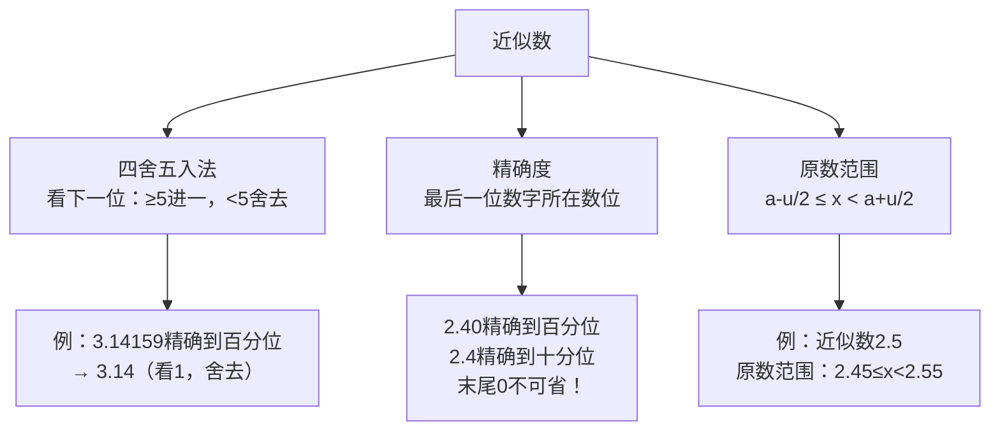

# 公式与定义卡片 · 近似数

## 知识结构

## 1. 四舍五入规则

看保留位的**下一位数字** $d$：

$$
d \ge 5 \implies \text{进一}, \qquad d < 5 \implies \text{舍去}
$$

## 2. 精确度的判断

$$
\text{精确度} = \text{近似数最后一位数字所在的数位}
$$

例如 $2.40$ 精确到百分位；$3.6 \times 10^4 = 36000$ 精确到千位。

## 3. 近似数的原数范围

若 $x$ 四舍五入到某位得近似数 $a$，设该位的一个单位为 $u$，则：

$$
a - \frac{u}{2} \le x < a + \frac{u}{2}
$$

例：$a = 2.5$（$u = 0.1$）时，$2.45 \le x < 2.55$。
