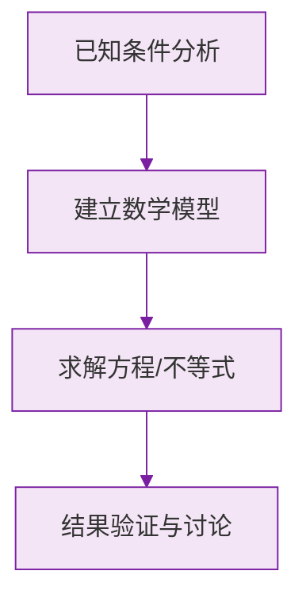

# 近似数

标签：#中考高频 #基础

## 一、准确数与近似数

- **准确数**：与实际完全符合的数。如"班里有 45 名同学"；
- **近似数**：与实际接近的数。如"珠峰高约 8848.86 米"、"圆周率取 3.14"。

生活中大量的数是近似数：测量总有误差，统计常取整。

## 二、精确度

近似数与准确数的接近程度用**精确度**表示。常见说法："精确到十分位（0.1）""精确到百位"等。

**四舍五入**是取近似数的基本方法：看**要保留的最后一位的下一位**，$\ge 5$ 进一，$< 5$ 舍去。

例：$\pi = 3.14159\dots$

| 要求 | 结果 |
|---|---|
| 精确到个位 | $3$ |
| 精确到 $0.1$（十分位） | $3.1$ |
| 精确到 $0.01$（百分位） | $3.14$ |
| 精确到 $0.001$（千分位） | $3.142$ |

## 三、判断一个近似数精确到哪一位

**看这个近似数的最后一位数字处在什么数位。**

- $2.4$ 精确到**十分位**；
- $2.40$ 精确到**百分位**——末尾的 0 不能随便去掉！

> ⚠️ **易错点**：近似数 $2.4$ 与 $2.40$ **不一样**：前者精确到 0.1，后者精确到 0.01。近似数末尾的 0 有意义。

## 四、带"万""亿"或科学记数法的精确度

- $3.6$ 万：最后一位 6 在**千位**上（$3.6\text{ 万} = 36000$），精确到千位；
- $2.13 \times 10^5 = 213000$：最后一位 3 在**千位**上，精确到千位。

> 💡 **方法**：先还原成原数，再看近似数的最后一位数字落在哪个数位。

## 五、由近似数反推原数范围（拔高）

若近似数 $a = 2.5$ 是四舍五入得到的，则原数 $x$ 满足：

$$
2.45 \le x < 2.55
$$

即"最后一位的下一位介于被舍去的 0~4 与进位的 5~9 之间"。

## 六、要点小结

1. 四舍五入取近似数，看下一位；
2. 精确度看**最后一位数字所在数位**；
3. 近似数末尾的 0 不可省略；
4. 带"万/亿"或科学记数法的，先还原再判断。

## 七、知识联系

- 与[[科学记数法]]结合是常考形式；
- 后续统计学习中"平均数保留一位小数"等要求都基于本节。

### 数学几何与函数分析

<svg xmlns="http://www.w3.org/2000/svg" viewBox="0 0 300 200" style="background-color: #f3e5f5; border: 1px solid #7b1fa2; border-radius: 8px;">
  <line x1="20" y1="180" x2="280" y2="180" stroke="#7b1fa2" stroke-width="2" />
  <line x1="50" y1="20" x2="50" y2="180" stroke="#7b1fa2" stroke-width="2" />
  <path d="M50,180 Q150,20 280,180" fill="none" stroke="#9c27b0" stroke-width="3" />
  <text x="260" y="195" fill="#7b1fa2" font-size="12">X轴</text>
  <text x="10" y="30" fill="#7b1fa2" font-size="12">Y轴</text>
  <text x="140" y="100" fill="#7b1fa2" font-size="14">抛物线图示</text>
</svg>

