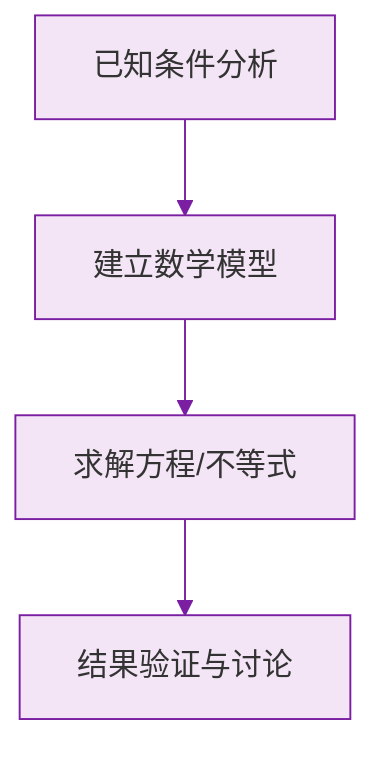

# 公式与定义卡片 · 列代数式

## 1. 常用数量关系

$$
\text{路程} = \text{速度} \times \text{时间}: \quad s = vt
$$

$$
\text{总价} = \text{单价} \times \text{数量}
$$

$$
\text{工作总量} = \text{工作效率} \times \text{工作时间}
$$

## 2. 增长与打折

增长 $p\%$ 后：

$$
a(1 + p\%)
$$

打 $x$ 折后：

$$
\text{原价} \times \frac{x}{10}
$$

## 3. 数位表示

两位数（十位 $a$，个位 $b$）：

$$
10a + b
$$

三位数（百位 $a$，十位 $b$，个位 $c$）：

$$
100a + 10b + c
$$

## 4. 奇偶数表示

设 $n$ 为整数：

$$
\text{偶数}: 2n, \qquad \text{奇数}: 2n + 1
$$

## 5. 连续整数

三个连续整数可设为：

$$
n - 1,\ n,\ n + 1
$$

### 数学几何与函数分析

<svg xmlns="http://www.w3.org/2000/svg" viewBox="0 0 300 200" style="background-color: #f3e5f5; border: 1px solid #7b1fa2; border-radius: 8px;">
  <line x1="20" y1="180" x2="280" y2="180" stroke="#7b1fa2" stroke-width="2" />
  <line x1="50" y1="20" x2="50" y2="180" stroke="#7b1fa2" stroke-width="2" />
  <path d="M50,180 Q150,20 280,180" fill="none" stroke="#9c27b0" stroke-width="3" />
  <text x="260" y="195" fill="#7b1fa2" font-size="12">X轴</text>
  <text x="10" y="30" fill="#7b1fa2" font-size="12">Y轴</text>
  <text x="140" y="100" fill="#7b1fa2" font-size="14">抛物线图示</text>
</svg>

