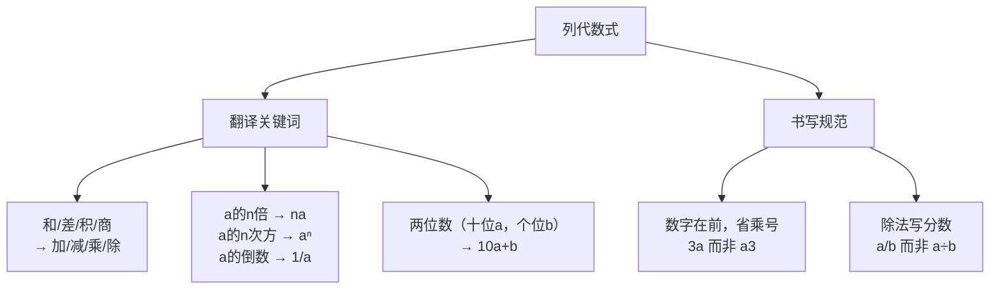

# 公式与定义卡片 · 列代数式

## 知识结构

## 1. 常用数量关系

$$
\text{路程} = \text{速度} \times \text{时间}: \quad s = vt
$$

$$
\text{总价} = \text{单价} \times \text{数量}
$$

$$
\text{工作总量} = \text{工作效率} \times \text{工作时间}
$$

## 2. 增长与打折

增长 $p\%$ 后：

$$
a(1 + p\%)
$$

打 $x$ 折后：

$$
\text{原价} \times \frac{x}{10}
$$

## 3. 数位表示

两位数（十位 $a$，个位 $b$）：

$$
10a + b
$$

三位数（百位 $a$，十位 $b$，个位 $c$）：

$$
100a + 10b + c
$$

## 4. 奇偶数表示

设 $n$ 为整数：

$$
\text{偶数}: 2n, \qquad \text{奇数}: 2n + 1
$$

## 5. 连续整数

三个连续整数可设为：

$$
n - 1,\ n,\ n + 1
$$
