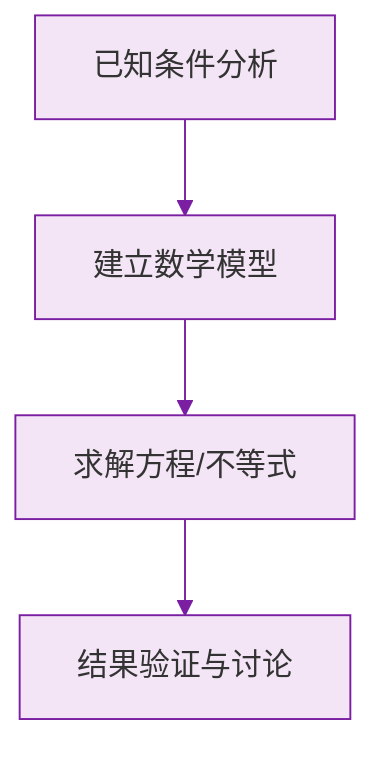

# 3.1 列代数式表示数量关系

标签：#中考必考 #基础

## 一、从算术到代数：用字母表示数

小学我们用具体的数计算，初中用**字母**代表数，就能把一类问题"一网打尽"：

- 正方形边长为 $a$，周长就是 $4a$——无论边长是 3 还是 100 都适用；
- 加法交换律写成 $a + b = b + a$，一个式子概括无数事实。

**用运算符号把数或表示数的字母连接起来的式子叫做代数式。** 单独的一个数或一个字母也是代数式，如 $5$、$x$。

## 二、代数式的书写规范

| 规范 | 正确 | 错误 |
|---|---|---|
| 数字与字母相乘，乘号省略，数字在前 | $3a$ | $a3$、$3 \times a$ |
| 字母与字母相乘，乘号省略 | $ab$ | $a \times b$ |
| 带分数与字母相乘，化成假分数 | $\frac{7}{2}a$ | $3\frac{1}{2}a$ |
| 除法写成分数形式 | $\frac{a}{3}$ | $a \div 3$ |
| 结果含加减时，若带单位要整体加括号 | $(a+2)$ 元 | $a + 2$ 元 |

> ⚠️ **易错点**："$1 \times a$"应直接写 $a$；"$-1 \times a$"应写 $-a$，系数 1 省略不写。

## 三、列代数式的常见句式翻译

| 文字语言 | 代数式 |
|---|---|
| $a$ 与 $b$ 的和 | $a + b$ |
| $a$ 与 $b$ 的差 | $a - b$ |
| $a$ 与 $b$ 的积 | $ab$ |
| $a$ 除以 $b$ 的商 | $\frac{a}{b}$ |
| $a$ 的 2 倍与 $b$ 的和 | $2a + b$ |
| $a$ 与 $b$ 的和的 2 倍 | $2(a + b)$ |
| 比 $x$ 的 3 倍多 5 的数 | $3x + 5$ |
| $a$ 的平方与 $b$ 的平方的和 | $a^2 + b^2$ |
| $a$ 与 $b$ 的和的平方 | $(a+b)^2$ |

> ⚠️ **易错点**："和的 2 倍"与"2 倍的和"位置不同，括号使用不同：$2(a+b) \ne 2a + b$。读题时抓"的"字断句。

## 四、列代数式解决实际问题

常见数量关系：

- 路程 $=$ 速度 $\times$ 时间：$s = vt$；
- 总价 $=$ 单价 $\times$ 数量；
- 打 $x$ 折后价格 $=$ 原价 $\times \frac{x}{10}$；
- 增长 $p\%$ 后的量 $=$ 原量 $\times (1 + p\%)$；
- 两位数：十位数字为 $a$、个位数字为 $b$，这个两位数是 $10a + b$（不是 $ab$！）。

## 五、要点小结

1. 代数式 = 数、字母用运算符号连起来的式子；
2. 书写规范：乘号省略、数字在前、除法写分数、带分数化假分数；
3. 抓关键词"的""比""多""少"准确翻译；
4. 两位数表示为 $10a + b$ 是经典模型。

## 六、知识联系

- 求出的代数式的值 → [[3.2 代数式的值]]；
- 代数式中的单项式、多项式概念 → [[4.1 整式]]；
- 列代数式是[[5.3 实际问题与一元一次方程|列方程解应用题]]的基本功。

### 数学几何与函数分析

<svg xmlns="http://www.w3.org/2000/svg" viewBox="0 0 300 200" style="background-color: #f3e5f5; border: 1px solid #7b1fa2; border-radius: 8px;">
  <line x1="20" y1="180" x2="280" y2="180" stroke="#7b1fa2" stroke-width="2" />
  <line x1="50" y1="20" x2="50" y2="180" stroke="#7b1fa2" stroke-width="2" />
  <path d="M50,180 Q150,20 280,180" fill="none" stroke="#9c27b0" stroke-width="3" />
  <text x="260" y="195" fill="#7b1fa2" font-size="12">X轴</text>
  <text x="10" y="30" fill="#7b1fa2" font-size="12">Y轴</text>
  <text x="140" y="100" fill="#7b1fa2" font-size="14">抛物线图示</text>
</svg>

