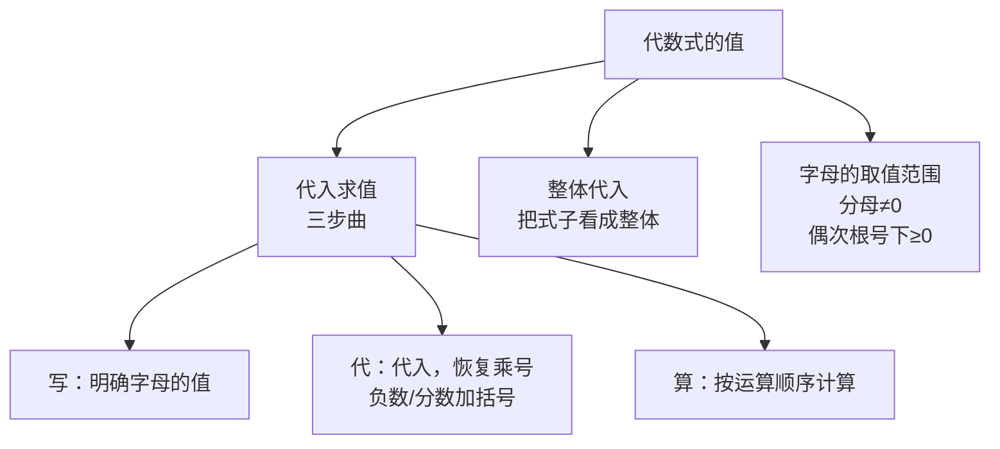

# 公式与定义卡片 · 代数式的值

## 知识结构

## 1. 代入求值流程

$$
\text{写条件} \to \text{代入（加括号、还原乘号）} \to \text{按序计算}
$$

## 2. 代入负数必加括号

$$
a = -2: \quad a^2 = (-2)^2 = 4 \neq -2^2
$$

## 3. 整体代入模型

已知 $a + b = m$，$ab = n$：

$$
p(a+b) + q \cdot ab = pm + qn
$$

已知 $x^2 + x = t$：

$$
kx^2 + kx + c = k(x^2 + x) + c = kt + c
$$

## 4. 常用公式（代数式的实际来源）

$$
S_{\text{三角形}} = \frac{1}{2}ah, \qquad C_{\text{圆}} = 2\pi r, \qquad F = \frac{9}{5}C + 32
$$
