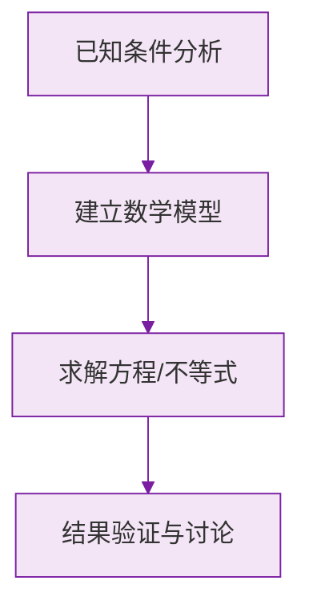

# 例题 · 代数式（章末综合）

## 例题 1（综合 · 列式+求值）

### 题目

学校买了 $a$ 支钢笔，每支 12 元；又买了 $b$ 本笔记本，每本 5 元。

(1) 用代数式表示总花费；
(2) 当 $a = 10$，$b = 24$ 时，求总花费。

### 解析

(1) 总花费：

$$
(12a + 5b) \text{ 元}
$$

(2) 代入 $a = 10$，$b = 24$：

$$
12 \times 10 + 5 \times 24 = 120 + 120 = 240
$$

**答案：(1) $(12a+5b)$ 元；(2) $240$ 元**

---

## 例题 2（综合 · 整体代入）

### 题目

已知 $2a - b = 4$，求代数式 $5 + 4a - 2b$ 的值。

### 解析

把 $4a - 2b$ 凑成 $2(2a - b)$：

$$
5 + 4a - 2b = 5 + 2(2a - b) = 5 + 2 \times 4 = 13
$$

**答案：$13$**

---

## 例题 3（综合 · 规律探究）

### 题目

将连续的正整数按下面方式排列：

第 1 行：$1$
第 2 行：$2\ \ 3$
第 3 行：$4\ \ 5\ \ 6$
第 4 行：$7\ \ 8\ \ 9\ \ 10$
……

(1) 第 $n$ 行有多少个数？
(2) 第 $n$ 行最后一个数是多少（用含 $n$ 的代数式表示）？
(3) 第 10 行的最后一个数是多少？

### 解析

(1) 观察每行个数为 $1, 2, 3, 4, \dots$，第 $n$ 行有 **$n$ 个**数。

(2) 第 $n$ 行最后一个数是前 $n$ 行数的总个数：

$$
1 + 2 + 3 + \cdots + n = \frac{n(n+1)}{2}
$$

(3) 代入 $n = 10$：

$$
\frac{10 \times 11}{2} = 55
$$

**答案：(1) $n$ 个；(2) $\frac{n(n+1)}{2}$；(3) $55$**

> 💡 $1+2+\cdots+n = \frac{n(n+1)}{2}$（高斯求和）是找规律题的常客，值得牢记。

---

## 例题 4（综合 · 易错检验）

### 题目

小亮说："当 $x = -1$ 时，代数式 $-x^2 + 2x$ 的值是 $3$。"他算得对吗？请写出正确过程。

### 解析

小亮把 $-x^2$ 错当成 $(-x)^2$ 了。正确代入：

$$
-x^2 + 2x = -(-1)^2 + 2 \times (-1) = -1 - 2 = -3
$$

**答案：不对，正确的值是 $-3$**

> ⚠️ $-x^2$ 的意思是"$x^2$ 的相反数"：先平方，再取负。$x = -1$ 时，$-x^2 = -1$。

### 数学几何与函数分析

<svg xmlns="http://www.w3.org/2000/svg" viewBox="0 0 300 200" style="background-color: #f3e5f5; border: 1px solid #7b1fa2; border-radius: 8px;">
  <line x1="20" y1="180" x2="280" y2="180" stroke="#7b1fa2" stroke-width="2" />
  <line x1="50" y1="20" x2="50" y2="180" stroke="#7b1fa2" stroke-width="2" />
  <path d="M50,180 Q150,20 280,180" fill="none" stroke="#9c27b0" stroke-width="3" />
  <text x="260" y="195" fill="#7b1fa2" font-size="12">X轴</text>
  <text x="10" y="30" fill="#7b1fa2" font-size="12">Y轴</text>
  <text x="140" y="100" fill="#7b1fa2" font-size="14">抛物线图示</text>
</svg>

