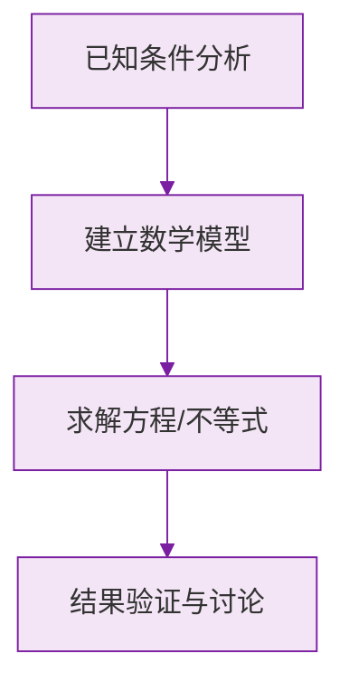

# 公式与定义卡片 · 代数式（章末汇总）

## 1. 常用翻译对照

$$
a \text{ 与 } b \text{ 的和的 2 倍}: 2(a+b), \qquad a \text{ 的 2 倍与 } b \text{ 的和}: 2a + b
$$

## 2. 数位与奇偶

$$
\text{两位数} = 10a + b, \qquad \text{偶数} = 2n, \qquad \text{奇数} = 2n+1
$$

## 3. 增长与打折

$$
\text{增长 } p\%: \ a(1 + p\%), \qquad \text{打 } x \text{ 折}: \ a \cdot \frac{x}{10}
$$

## 4. 代入求值原则

$$
\text{负数、分数代入必加括号}: \quad a = -2 \implies a^2 = (-2)^2
$$

## 5. 整体代入模型

$$
\text{已知 } x^2 + x = t \implies kx^2 + kx + c = kt + c
$$

## 6. 等差型规律通项

首项 $a_1$，每次增加 $d$：

$$
a_n = a_1 + (n-1)d
$$

### 数学几何与函数分析

<svg xmlns="http://www.w3.org/2000/svg" viewBox="0 0 300 200" style="background-color: #f3e5f5; border: 1px solid #7b1fa2; border-radius: 8px;">
  <line x1="20" y1="180" x2="280" y2="180" stroke="#7b1fa2" stroke-width="2" />
  <line x1="50" y1="20" x2="50" y2="180" stroke="#7b1fa2" stroke-width="2" />
  <path d="M50,180 Q150,20 280,180" fill="none" stroke="#9c27b0" stroke-width="3" />
  <text x="260" y="195" fill="#7b1fa2" font-size="12">X轴</text>
  <text x="10" y="30" fill="#7b1fa2" font-size="12">Y轴</text>
  <text x="140" y="100" fill="#7b1fa2" font-size="14">抛物线图示</text>
</svg>

