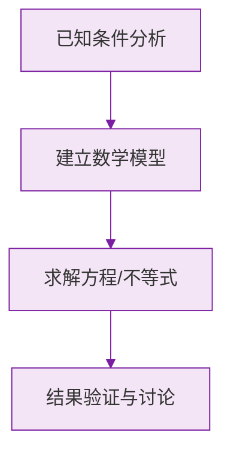

# 例题 · 整式

## 例题 1（基础 · 系数与次数）

### 题目

写出下列单项式的系数和次数：

(1) $-3x^2y$；(2) $\frac{ab^2c}{4}$；(3) $-m$；(4) $2\pi r^2$。

### 解析

| 单项式 | 系数 | 次数 |
|---|---|---|
| $-3x^2y$ | $-3$ | $2+1=3$ |
| $\frac{ab^2c}{4} = \frac{1}{4}ab^2c$ | $\frac{1}{4}$ | $1+2+1=4$ |
| $-m$ | $-1$ | $1$ |
| $2\pi r^2$ | $2\pi$ | $2$ |

> ⚠️ $\pi$ 是常数，算进系数，不算次数。

---

## 例题 2（基础 · 多项式辨析）

### 题目

对于多项式 $3x^2y - 4xy + 5x - 7$：

(1) 它是几次几项式？
(2) 写出它的最高次项和常数项。

### 解析

(1) 各项次数：$3x^2y$ 为 3 次，$-4xy$ 为 2 次，$5x$ 为 1 次，$-7$ 为 0 次。最高次数是 3，共 4 项，是**三次四项式**。

(2) 最高次项是 $3x^2y$；常数项是 $-7$（带符号！）。

**答案：(1) 三次四项式；(2) 最高次项 $3x^2y$，常数项 $-7$**

---

## 例题 3（中档 · 整式判断）

### 题目

下列代数式中，哪些是单项式？哪些是多项式？哪些不是整式？

$$
\frac{x}{2}, \qquad \frac{2}{x}, \qquad 0, \qquad x^2 + \frac{1}{2}, \qquad \frac{x+y}{3}, \qquad \frac{3}{a+b}
$$

### 解析

- $\frac{x}{2} = \frac{1}{2}x$：**单项式**；
- $\frac{2}{x}$：分母含字母，**不是整式**；
- $0$：单独的数，**单项式**；
- $x^2 + \frac{1}{2}$：两个单项式的和，**多项式**；
- $\frac{x+y}{3} = \frac{1}{3}x + \frac{1}{3}y$：**多项式**；
- $\frac{3}{a+b}$：分母含字母，**不是整式**。

> 💡 判断标准只有一条：**字母在不在分母里**。在 → 不是整式。

---

## 例题 4（提高 · 含参数确定次数）

### 题目

已知关于 $x$、$y$ 的单项式 $-5x^{m}y^{3}$ 的次数是 7，多项式 $2x^{n+1}y - x^2y + 1$ 是三次多项式，求 $m + n$ 的值。

### 解析

单项式次数 = 指数和：

$$
m + 3 = 7 \implies m = 4
$$

多项式是三次的，最高次项 $2x^{n+1}y$ 的次数为 $(n+1) + 1 = 3$：

$$
n + 2 = 3 \implies n = 1
$$

（检验：此时另一项 $-x^2y$ 的次数是 3，最高次仍为 3 ✔）

$$
m + n = 4 + 1 = 5
$$

**答案：$5$**

> 💡 含字母指数的题，把"次数"翻译成**指数的方程**即可。

### 数学几何与函数分析

<svg xmlns="http://www.w3.org/2000/svg" viewBox="0 0 300 200" style="background-color: #f3e5f5; border: 1px solid #7b1fa2; border-radius: 8px;">
  <line x1="20" y1="180" x2="280" y2="180" stroke="#7b1fa2" stroke-width="2" />
  <line x1="50" y1="20" x2="50" y2="180" stroke="#7b1fa2" stroke-width="2" />
  <path d="M50,180 Q150,20 280,180" fill="none" stroke="#9c27b0" stroke-width="3" />
  <text x="260" y="195" fill="#7b1fa2" font-size="12">X轴</text>
  <text x="10" y="30" fill="#7b1fa2" font-size="12">Y轴</text>
  <text x="140" y="100" fill="#7b1fa2" font-size="14">抛物线图示</text>
</svg>

