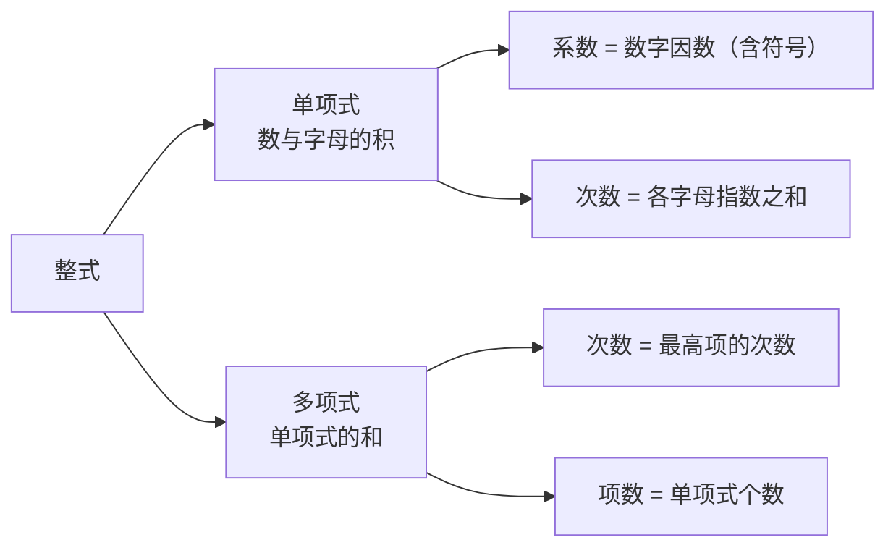

# 公式与定义卡片 · 整式

## 1. 概念体系

## 2. 单项式的系数与次数

单项式 $k \, x^{m} y^{n}$：

$$
\text{系数} = k \ (\text{含符号}), \qquad \text{次数} = m + n
$$

## 3. 多项式的次数

$$
\text{多项式的次数} = \text{次数最高的项的次数}
$$

## 4. 判别式子是否为整式

$$
\text{分母含字母} \implies \text{不是整式}
$$

## 5. 命名规则

次数为 $n$、共 $m$ 项的多项式称为"$n$ 次 $m$ 项式"：

$$
x^2 - 3x + 2 \ \text{是二次三项式}
$$
