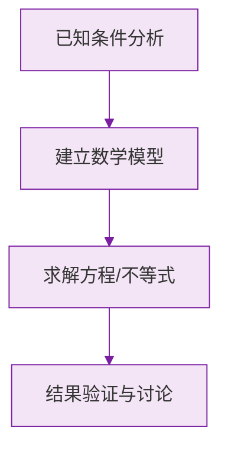

# 公式与定义卡片 · 整式

## 1. 概念体系

$$
\text{整式}
\begin{cases}
\text{单项式（数与字母的积）} \\
\text{多项式（单项式的和）}
\end{cases}
$$

## 2. 单项式的系数与次数

单项式 $k \, x^{m} y^{n}$：

$$
\text{系数} = k \ (\text{含符号}), \qquad \text{次数} = m + n
$$

## 3. 多项式的次数

$$
\text{多项式的次数} = \text{次数最高的项的次数}
$$

## 4. 判别式子是否为整式

$$
\text{分母含字母} \implies \text{不是整式}
$$

## 5. 命名规则

次数为 $n$、共 $m$ 项的多项式称为"$n$ 次 $m$ 项式"：

$$
x^2 - 3x + 2 \ \text{是二次三项式}
$$

### 数学几何与函数分析

<svg xmlns="http://www.w3.org/2000/svg" viewBox="0 0 300 200" style="background-color: #f3e5f5; border: 1px solid #7b1fa2; border-radius: 8px;">
  <line x1="20" y1="180" x2="280" y2="180" stroke="#7b1fa2" stroke-width="2" />
  <line x1="50" y1="20" x2="50" y2="180" stroke="#7b1fa2" stroke-width="2" />
  <path d="M50,180 Q150,20 280,180" fill="none" stroke="#9c27b0" stroke-width="3" />
  <text x="260" y="195" fill="#7b1fa2" font-size="12">X轴</text>
  <text x="10" y="30" fill="#7b1fa2" font-size="12">Y轴</text>
  <text x="140" y="100" fill="#7b1fa2" font-size="14">抛物线图示</text>
</svg>

