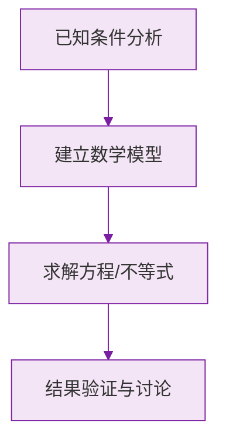

# 4.1 整式

标签：#中考必考 #基础

## 一、单项式

**由数与字母的乘积组成的代数式叫做单项式**。单独的一个数或一个字母也是单项式。

例如：$3x$、$-\frac{2}{5}ab^2$、$7$、$m$ 都是单项式。

两个重要属性：

| 属性 | 定义 | 例：$-\frac{2}{5}ab^2$ |
|---|---|---|
| **系数** | 单项式中的数字因数 | $-\frac{2}{5}$ |
| **次数** | 所有字母的指数的**和** | $1 + 2 = 3$（三次单项式） |

> ⚠️ **易错点**：
> 1. 系数包含**符号**：$-ab$ 的系数是 $-1$（不是 1，也不能说没有系数）；
> 2. $\pi$ 是数不是字母：$2\pi r$ 的系数是 $2\pi$，次数是 1；
> 3. 分母含字母的式子（如 $\frac{3}{x}$）**不是**单项式（也不是整式）。

## 二、多项式

**几个单项式的和叫做多项式**。

例如：$x^2 - 3x + 2$ 是多项式，它由 $x^2$、$-3x$、$2$ 三项组成。

| 概念 | 含义 | 例：$x^2 - 3x + 2$ |
|---|---|---|
| **项** | 组成多项式的每个单项式（带符号） | $x^2$、$-3x$、$+2$ |
| **常数项** | 不含字母的项 | $2$ |
| **次数** | **次数最高的项**的次数 | 2（二次三项式） |

> ⚠️ **易错点**：
> 1. 项要**连同前面的符号**："$-3x$" 这一项是负的；
> 2. 多项式的次数是"最高项的次数"，**不是**各项次数之和：$x^2y + x - 1$ 是**三次**三项式（$x^2y$ 的次数为 $2+1=3$）。

## 三、整式

**单项式与多项式统称整式。**

判断口诀：**分母不含字母**的代数式才可能是整式。

| 代数式 | 是否整式 | 类型 |
|---|---|---|
| $-5x^2y$ | ✔ | 单项式 |
| $\frac{x+1}{2}$ | ✔ | 多项式（$=\frac{1}{2}x + \frac{1}{2}$） |
| $\frac{2}{x}$ | ✘ | 分母含字母（分式，初二学） |
| $8$ | ✔ | 单项式 |

## 四、多项式的排列（了解）

为了书写整齐，常把多项式按某个字母的指数**从大到小**排列（降幂排列）或**从小到大**排列（升幂排列）：

$$
2x - 1 + 3x^2 \xrightarrow{\text{按 } x \text{ 降幂}} 3x^2 + 2x - 1
$$

## 五、要点小结

1. 单项式 = 数 × 字母；系数带符号，次数是字母指数之和；
2. 多项式 = 单项式的和；次数看最高项；项带符号；
3. 整式 = 单项式 + 多项式；分母含字母的不是整式；
4. 排列时每一项要"拖家带口"（连同符号）一起移动。

## 六、知识联系

- 单项式、多项式的概念是[[4.2 整式的加法与减法|合并同类项]]的前提；
- [[3.1 列代数式表示数量关系|代数式]]中大部分常见式子都是整式；
- 初二将学习整式的乘除与因式分解。

### 数学几何与函数分析

<svg xmlns="http://www.w3.org/2000/svg" viewBox="0 0 300 200" style="background-color: #f3e5f5; border: 1px solid #7b1fa2; border-radius: 8px;">
  <line x1="20" y1="180" x2="280" y2="180" stroke="#7b1fa2" stroke-width="2" />
  <line x1="50" y1="20" x2="50" y2="180" stroke="#7b1fa2" stroke-width="2" />
  <path d="M50,180 Q150,20 280,180" fill="none" stroke="#9c27b0" stroke-width="3" />
  <text x="260" y="195" fill="#7b1fa2" font-size="12">X轴</text>
  <text x="10" y="30" fill="#7b1fa2" font-size="12">Y轴</text>
  <text x="140" y="100" fill="#7b1fa2" font-size="14">抛物线图示</text>
</svg>

