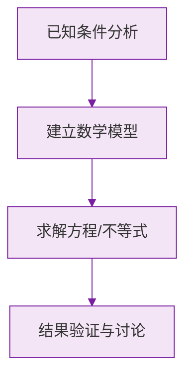

# 例题 · 整式的加法与减法

## 例题 1（基础 · 同类项判断与合并）

### 题目

(1) 判断 $2a^2b$ 与 $-3ba^2$ 是否为同类项；
(2) 合并同类项：$4x^2 - 3x + 7x^2 + 5x - 6$。

### 解析

(1) 两式所含字母都是 $a$、$b$，且 $a$ 的指数都是 2、$b$ 的指数都是 1，字母顺序不影响判断——**是同类项**。

(2) 分组合并：

$$
(4x^2 + 7x^2) + (-3x + 5x) - 6 = 11x^2 + 2x - 6
$$

**答案：(1) 是；(2) $11x^2 + 2x - 6$**

---

## 例题 2（基础 · 去括号）

### 题目

化简：$3a - 2(a - 2b) + (a - b)$。

### 解析

先去括号（注意 $-2$ 要乘进每一项）：

$$
3a - 2a + 4b + a - b
$$

合并同类项：

$$
(3 - 2 + 1)a + (4 - 1)b = 2a + 3b
$$

**答案：$2a + 3b$**

> ⚠️ $-2(a - 2b) = -2a + 4b$，第二项是 $(-2) \times (-2b) = +4b$，负负得正。

---

## 例题 3（中档 · 先化简再求值）

### 题目

先化简，再求值：$5xy^2 - 2(3xy^2 - x^2y) + (2xy^2 - 3x^2y)$，其中 $x = \frac{1}{2}$，$y = -1$。

### 解析

去括号：

$$
5xy^2 - 6xy^2 + 2x^2y + 2xy^2 - 3x^2y
$$

合并同类项：

$$
(5 - 6 + 2)xy^2 + (2 - 3)x^2y = xy^2 - x^2y
$$

代入 $x = \frac{1}{2}$，$y = -1$：

$$
\frac{1}{2} \times (-1)^2 - \left(\frac{1}{2}\right)^2 \times (-1) = \frac{1}{2} + \frac{1}{4} = \frac{3}{4}
$$

**答案：化简结果 $xy^2 - x^2y$；值为 $\frac{3}{4}$**

---

## 例题 4（中档 · 整式加减的文字表述）

### 题目

求多项式 $2x^2 - x + 3$ 与 $-x^2 + 3x - 5$ 的和与差。

### 解析

**和**：

$$
(2x^2 - x + 3) + (-x^2 + 3x - 5) = x^2 + 2x - 2
$$

**差**（前减后，减式整体加括号）：

$$
(2x^2 - x + 3) - (-x^2 + 3x - 5) = 2x^2 - x + 3 + x^2 - 3x + 5 = 3x^2 - 4x + 8
$$

**答案：和为 $x^2 + 2x - 2$；差为 $3x^2 - 4x + 8$**

> ⚠️ 求差时后一个多项式必须**整体加括号再去括号**，否则符号必错。

---

## 例题 5（提高 · 与字母取值无关）

### 题目

已知代数式 $(2x^2 + ax - y) - (3bx^2 - x + y - 6)$ 的值与 $x$ 的取值无关，求 $a$、$b$ 的值。

### 解析

先化简：

$$
2x^2 + ax - y - 3bx^2 + x - y + 6 = (2 - 3b)x^2 + (a + 1)x - 2y + 6
$$

"与 $x$ 无关"意味着含 $x$ 的项的系数都为 $0$：

$$
2 - 3b = 0 \implies b = \frac{2}{3}, \qquad a + 1 = 0 \implies a = -1
$$

**答案：$a = -1$，$b = \frac{2}{3}$**

> 💡 "与某字母无关" = 该字母各次项**系数为零**，这是经典套路题。

### 数学几何与函数分析

<svg xmlns="http://www.w3.org/2000/svg" viewBox="0 0 300 200" style="background-color: #f3e5f5; border: 1px solid #7b1fa2; border-radius: 8px;">
  <line x1="20" y1="180" x2="280" y2="180" stroke="#7b1fa2" stroke-width="2" />
  <line x1="50" y1="20" x2="50" y2="180" stroke="#7b1fa2" stroke-width="2" />
  <path d="M50,180 Q150,20 280,180" fill="none" stroke="#9c27b0" stroke-width="3" />
  <text x="260" y="195" fill="#7b1fa2" font-size="12">X轴</text>
  <text x="10" y="30" fill="#7b1fa2" font-size="12">Y轴</text>
  <text x="140" y="100" fill="#7b1fa2" font-size="14">抛物线图示</text>
</svg>

