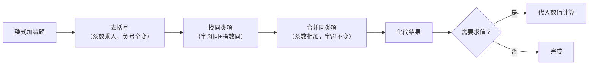

# 公式与定义卡片 · 整式的加法与减法

## 1. 合并同类项

$$
ma + na = (m + n)a
$$

系数相加，字母与指数不变。

## 2. 去括号法则

$$
a + (b - c) = a + b - c
$$

$$
a - (b - c) = a - b + c
$$

## 3. 分配律去括号（括号前有系数）

$$
m(a + b) = ma + mb, \qquad -m(a + b) = -ma - mb
$$

## 4. 添括号法则（去括号的逆运算）

$$
a + b - c = a + (b - c) = a - (-b + c)
$$

括号前添 "$-$"，括号内各项变号。

## 5. 整式加减流程

## 6. 求值题标准流程

$$
\text{先化简} \longrightarrow \text{再代入} \longrightarrow \text{后计算}
$$
