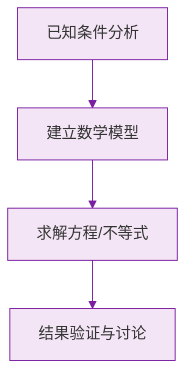

# 公式与定义卡片 · 整式的加法与减法

## 1. 合并同类项

$$
ma + na = (m + n)a
$$

系数相加，字母与指数不变。

## 2. 去括号法则

$$
a + (b - c) = a + b - c
$$

$$
a - (b - c) = a - b + c
$$

## 3. 分配律去括号（括号前有系数）

$$
m(a + b) = ma + mb, \qquad -m(a + b) = -ma - mb
$$

## 4. 添括号法则（去括号的逆运算）

$$
a + b - c = a + (b - c) = a - (-b + c)
$$

括号前添 "$-$"，括号内各项变号。

## 5. 整式加减流程

$$
\text{去括号} \longrightarrow \text{合并同类项}
$$

## 6. 求值题标准流程

$$
\text{先化简} \longrightarrow \text{再代入} \longrightarrow \text{后计算}
$$

### 数学几何与函数分析

<svg xmlns="http://www.w3.org/2000/svg" viewBox="0 0 300 200" style="background-color: #f3e5f5; border: 1px solid #7b1fa2; border-radius: 8px;">
  <line x1="20" y1="180" x2="280" y2="180" stroke="#7b1fa2" stroke-width="2" />
  <line x1="50" y1="20" x2="50" y2="180" stroke="#7b1fa2" stroke-width="2" />
  <path d="M50,180 Q150,20 280,180" fill="none" stroke="#9c27b0" stroke-width="3" />
  <text x="260" y="195" fill="#7b1fa2" font-size="12">X轴</text>
  <text x="10" y="30" fill="#7b1fa2" font-size="12">Y轴</text>
  <text x="140" y="100" fill="#7b1fa2" font-size="14">抛物线图示</text>
</svg>

