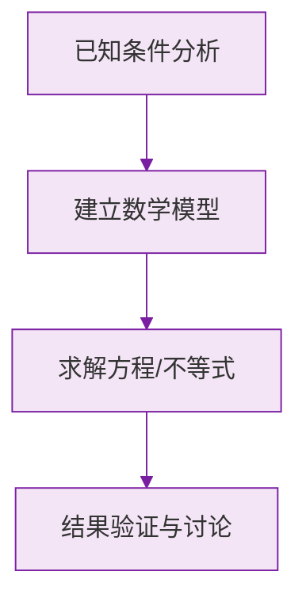

# 例题 · 整式的加减（章末综合）

## 例题 1（综合 · 概念全覆盖）

### 题目

对于多项式 $-\frac{1}{3}x^2y + 2xy - 5$：

(1) 它是几次几项式？
(2) 写出二次项的系数与常数项；
(3) 写出它的一个同类多项式中与 $-\frac{1}{3}x^2y$ 是同类项的项（举例）。

### 解析

(1) 各项次数：$-\frac{1}{3}x^2y$ 是 3 次，$2xy$ 是 2 次，$-5$ 是 0 次——**三次三项式**。

(2) 二次项是 $2xy$，系数为 $2$；常数项为 $-5$。

(3) 与 $-\frac{1}{3}x^2y$ 同类的项：字母为 $x$、$y$ 且指数分别为 2、1 即可，如 $5x^2y$、$-yx^2$。

---

## 例题 2（综合 · 化简求值）

### 题目

先化简，再求值：$2(a^2b + ab^2) - 2(a^2b - 1) - 2ab^2 - 2$，其中 $a = -2$，$b = 3$。

### 解析

去括号：

$$
2a^2b + 2ab^2 - 2a^2b + 2 - 2ab^2 - 2
$$

合并同类项：所有项恰好两两相消，结果为 $0$。

**答案：化简结果为 $0$，与 $a$、$b$ 的取值无关，值为 $0$**

> 💡 化简后为常数（甚至为 0）的题，说明"求值"只是幌子——不用代入！

---

## 例题 3（综合 · 求错改错）

### 题目

小华在计算"多项式 $A$ 减去 $x^2 - 3x + 2$"时，误把"减去"当成了"加上"，得到的结果是 $3x^2 - 2x + 5$。请求出正确的结果。

### 解析

先反推 $A$：

$$
A = (3x^2 - 2x + 5) - (x^2 - 3x + 2) = 2x^2 + x + 3
$$

再算正确结果：

$$
A - (x^2 - 3x + 2) = (2x^2 + x + 3) - (x^2 - 3x + 2) = x^2 + 4x + 1
$$

**答案：$x^2 + 4x + 1$**

> 💡 "看错题型"问题两步走：先由错误结果**反求原式**，再按正确要求计算。

---

## 例题 4（综合 · 几何背景）

### 题目

一个长方形的长为 $(3a + 2b)$，宽为 $(2a - b)$（$2a > b$）。用整式表示它的周长，并求当 $a = 3$，$b = 2$ 时的周长。

### 解析

周长 $= 2(\text{长} + \text{宽})$：

$$
2\left[(3a + 2b) + (2a - b)\right] = 2(5a + b) = 10a + 2b
$$

代入 $a = 3$，$b = 2$：

$$
10 \times 3 + 2 \times 2 = 34
$$

**答案：周长为 $10a + 2b$；当 $a=3$，$b=2$ 时周长为 $34$**

### 数学几何与函数分析

<svg xmlns="http://www.w3.org/2000/svg" viewBox="0 0 300 200" style="background-color: #f3e5f5; border: 1px solid #7b1fa2; border-radius: 8px;">
  <line x1="20" y1="180" x2="280" y2="180" stroke="#7b1fa2" stroke-width="2" />
  <line x1="50" y1="20" x2="50" y2="180" stroke="#7b1fa2" stroke-width="2" />
  <path d="M50,180 Q150,20 280,180" fill="none" stroke="#9c27b0" stroke-width="3" />
  <text x="260" y="195" fill="#7b1fa2" font-size="12">X轴</text>
  <text x="10" y="30" fill="#7b1fa2" font-size="12">Y轴</text>
  <text x="140" y="100" fill="#7b1fa2" font-size="14">抛物线图示</text>
</svg>

