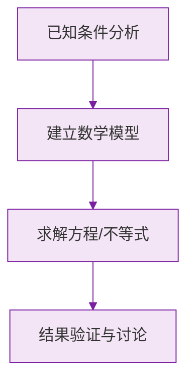

# 公式与定义卡片 · 整式的加减（章末汇总）

## 1. 概念链

$$
\text{单项式} \xrightarrow{\text{求和}} \text{多项式}, \qquad \text{两者统称整式}
$$

## 2. 合并同类项

$$
ma + na = (m+n)a
$$

## 3. 去括号

$$
+(a - b) = a - b, \qquad -(a - b) = -a + b
$$

$$
m(a+b) = ma + mb
$$

## 4. 整式的和与差

$$
A + B: \ \text{直接去括号合并}
$$

$$
A - B = A - (B): \ \text{减式整体加括号}
$$

## 5. 与 $x$ 无关的条件

化简为 $px^2 + qx + r$ 后：

$$
\text{与 } x \text{ 无关} \iff p = 0 \text{ 且 } q = 0
$$

### 数学几何与函数分析

<svg xmlns="http://www.w3.org/2000/svg" viewBox="0 0 300 200" style="background-color: #f3e5f5; border: 1px solid #7b1fa2; border-radius: 8px;">
  <line x1="20" y1="180" x2="280" y2="180" stroke="#7b1fa2" stroke-width="2" />
  <line x1="50" y1="20" x2="50" y2="180" stroke="#7b1fa2" stroke-width="2" />
  <path d="M50,180 Q150,20 280,180" fill="none" stroke="#9c27b0" stroke-width="3" />
  <text x="260" y="195" fill="#7b1fa2" font-size="12">X轴</text>
  <text x="10" y="30" fill="#7b1fa2" font-size="12">Y轴</text>
  <text x="140" y="100" fill="#7b1fa2" font-size="14">抛物线图示</text>
</svg>

