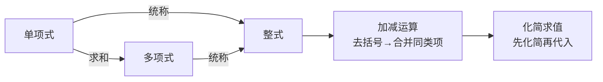

# 公式与定义卡片 · 整式的加减（章末汇总）

## 1. 概念链

## 2. 合并同类项

$$
ma + na = (m+n)a
$$

## 3. 去括号

$$
+(a - b) = a - b, \qquad -(a - b) = -a + b
$$

$$
m(a+b) = ma + mb
$$

## 4. 整式的和与差

$$
A + B: \ \text{直接去括号合并}
$$

$$
A - B = A - (B): \ \text{减式整体加括号}
$$

## 5. 与 $x$ 无关的条件

化简为 $px^2 + qx + r$ 后：

$$
\text{与 } x \text{ 无关} \iff p = 0 \text{ 且 } q = 0
$$
