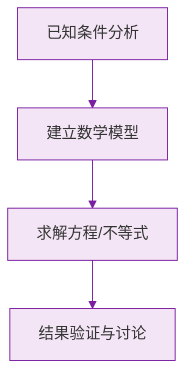

# 整式的加减 · 重点梳理

标签：#基础 #复习整合

> 本页是第四章《整式的加减》的复习整合页，串联[[4.1 整式]]与[[4.2 整式的加法与减法]]。

## 一、本章知识结构

- **整式**
  - 单项式：系数、次数
  - 多项式：项、常数项、次数
- **整式的加减**
  - 同类项 → 合并同类项
  - 去括号法则
  - 整式加减 = 去括号 + 合并同类项
  - 应用：先化简再求值

## 二、核心概念对照表

| 概念 | 关键点 | 反例警示 |
|---|---|---|
| 系数 | 带符号的数字因数，$\pi$ 算数字 | $-ab$ 的系数是 $-1$ |
| 单项式次数 | 所有字母指数**之和** | $2\pi r^2$ 是 2 次不是 3 次 |
| 多项式次数 | **最高项**的次数 | 不是各项次数相加 |
| 同类项 | 字母同 + 指数同 | $x^2y$ 与 $xy^2$ 不是 |
| 合并 | 系数相加，字母指数**不变** | $2x^2+3x^2 \ne 5x^4$ |
| 去括号 | 负号开路**全变号** | $-(a-b) = -a+b$ |

## 三、方法提炼

### 1. 整式加减标准流程

$$
\text{（系数乘入）去括号} \to \text{找同类项} \to \text{合并}
$$

### 2. 求差的防错写法

"$A$ 减去 $B$"一律写成 $A - (B)$，**先套括号**再展开。

### 3. "先化简再求值"

化简彻底后再代入，代负数、分数加括号。

### 4. "与 $x$ 无关"型

化简后令含 $x$ 各项系数为 $0$，解出参数。

## 四、易错点集中检查

1. 去括号只变第一项的符号（最高频错误）；
2. $-2(a - 3b)$ 漏乘第二项，错写成 $-2a - 3b$；
3. 合并同类项时把指数也加了；
4. 求"差"不加括号直接抄，符号全乱；
5. 把 $\frac{2}{x}$ 当成整式。

## 五、自测清单

- [ ] 能准确说出任意单项式的系数与次数
- [ ] 能判断两项是否为同类项
- [ ] 去括号（含系数、含负号）不出错
- [ ] 会做"先化简再求值"，格式规范
- [ ] 会做"与字母取值无关"的参数题

## 六、通往下一章

整式的化简能力马上要在[[5.2 解一元一次方程|解方程]]中大显身手——"去括号、合并同类项"正是解方程的两个核心步骤。

### 数学几何与函数分析

<svg xmlns="http://www.w3.org/2000/svg" viewBox="0 0 300 200" style="background-color: #f3e5f5; border: 1px solid #7b1fa2; border-radius: 8px;">
  <line x1="20" y1="180" x2="280" y2="180" stroke="#7b1fa2" stroke-width="2" />
  <line x1="50" y1="20" x2="50" y2="180" stroke="#7b1fa2" stroke-width="2" />
  <path d="M50,180 Q150,20 280,180" fill="none" stroke="#9c27b0" stroke-width="3" />
  <text x="260" y="195" fill="#7b1fa2" font-size="12">X轴</text>
  <text x="10" y="30" fill="#7b1fa2" font-size="12">Y轴</text>
  <text x="140" y="100" fill="#7b1fa2" font-size="14">抛物线图示</text>
</svg>

