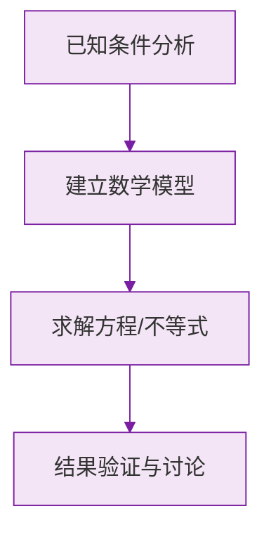

# 例题 · 从算式到方程

## 例题 1（基础 · 辨认一元一次方程）

### 题目

下列各式中，是一元一次方程的是（　　）

A. $x + 2y = 3$　　B. $x^2 - 1 = 0$　　C. $\frac{2}{x} = 1$　　D. $\frac{x}{2} - 1 = 0$

### 解析

- A：含两个未知数，不是"一元"；
- B：未知数次数为 2，不是"一次"；
- C：未知数在分母，左边不是整式；
- D：一个未知数、次数 1、两边是整式 ✔。

**答案：D**

> 💡 $\frac{x}{2}$（$x$ 除以 2）是整式；$\frac{2}{x}$（2 除以 $x$）不是——分子分母位置是关键。

---

## 例题 2（基础 · 检验方程的解）

### 题目

检验 $x = -1$ 和 $x = 3$ 是不是方程 $2x - 3 = x$ 的解。

### 解析

**检验 $x = -1$**：左边 $= 2 \times (-1) - 3 = -5$，右边 $= -1$。左 $\ne$ 右，不是解。

**检验 $x = 3$**：左边 $= 2 \times 3 - 3 = 3$，右边 $= 3$。左 $=$ 右 ✔，是解。

**答案：$x = 3$ 是方程的解，$x = -1$ 不是**

> 💡 检验的格式：分别计算左边、右边，再比较——不要直接"移项验算"。

---

## 例题 3（中档 · 由方程概念求参数）

### 题目

已知关于 $x$ 的方程 $(m - 2)x^{|m| - 1} + 3 = 0$ 是一元一次方程，求 $m$ 的值。

### 解析

"一次"要求指数为 1：

$$
|m| - 1 = 1 \implies |m| = 2 \implies m = \pm 2
$$

但系数 $(m - 2)$ 不能为 $0$（否则没有未知数项），即 $m \ne 2$。

所以 $m = -2$。

**答案：$m = -2$**

> ⚠️ 别忘了检查**系数非零**这个隐藏条件，只答 $m = \pm 2$ 会丢分。

---

## 例题 4（中档 · 列方程）

### 题目

只列方程不求解：某班学生人数 $x$ 人，参加植树活动时平均每人植树 3 棵，共植树 135 棵。

### 解析

相等关系：**每人棵数 × 人数 = 总棵数**：

$$
3x = 135
$$

**答案：$3x = 135$**

---

## 例题 5（提高 · 从两个角度表示同一个量）

### 题目

把一批图书分给某班同学：若每人分 3 本，则剩余 20 本；若每人分 4 本，则还缺 25 本。设该班有 $x$ 名学生，列出方程。

### 解析

两种分法中，**图书总数不变**，从两个角度表示它：

- 每人 3 本剩 20 本：总数 $= 3x + 20$；
- 每人 4 本缺 25 本：总数 $= 4x - 25$。

所以：

$$
3x + 20 = 4x - 25
$$

**答案：$3x + 20 = 4x - 25$**

> 💡 "盈亏问题"的固定思路：**用不变量（总数）两边表示**。"剩"用加、"缺"用减。

### 数学几何与函数分析

<svg xmlns="http://www.w3.org/2000/svg" viewBox="0 0 300 200" style="background-color: #f3e5f5; border: 1px solid #7b1fa2; border-radius: 8px;">
  <line x1="20" y1="180" x2="280" y2="180" stroke="#7b1fa2" stroke-width="2" />
  <line x1="50" y1="20" x2="50" y2="180" stroke="#7b1fa2" stroke-width="2" />
  <path d="M50,180 Q150,20 280,180" fill="none" stroke="#9c27b0" stroke-width="3" />
  <text x="260" y="195" fill="#7b1fa2" font-size="12">X轴</text>
  <text x="10" y="30" fill="#7b1fa2" font-size="12">Y轴</text>
  <text x="140" y="100" fill="#7b1fa2" font-size="14">抛物线图示</text>
</svg>

