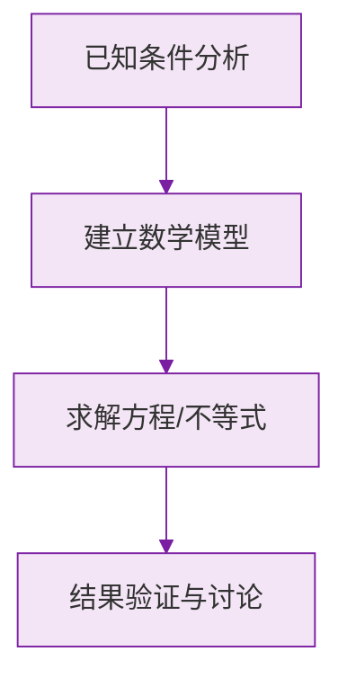

# 公式与定义卡片 · 从算式到方程

## 1. 方程的定义

$$
\text{方程} = \text{等式} + \text{含未知数}
$$

## 2. 一元一次方程的标准形式

$$
ax + b = 0 \quad (a \neq 0)
$$

三要素：一个未知数、次数为 1、两边都是整式。

## 3. 方程的解的检验

$x = m$ 是方程的解：

$$
\text{左边}\big|_{x=m} = \text{右边}\big|_{x=m}
$$

## 4. 列方程三步

$$
\text{审} \to \text{设} \to \text{列（找相等关系）}
$$

### 数学几何与函数分析

<svg xmlns="http://www.w3.org/2000/svg" viewBox="0 0 300 200" style="background-color: #f3e5f5; border: 1px solid #7b1fa2; border-radius: 8px;">
  <line x1="20" y1="180" x2="280" y2="180" stroke="#7b1fa2" stroke-width="2" />
  <line x1="50" y1="20" x2="50" y2="180" stroke="#7b1fa2" stroke-width="2" />
  <path d="M50,180 Q150,20 280,180" fill="none" stroke="#9c27b0" stroke-width="3" />
  <text x="260" y="195" fill="#7b1fa2" font-size="12">X轴</text>
  <text x="10" y="30" fill="#7b1fa2" font-size="12">Y轴</text>
  <text x="140" y="100" fill="#7b1fa2" font-size="14">抛物线图示</text>
</svg>

