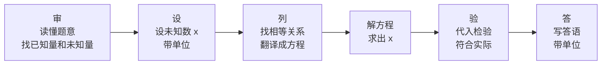

# 公式与定义卡片 · 从算式到方程

## 1. 方程的定义

$$
\text{方程} = \text{等式} + \text{含未知数}
$$

## 2. 一元一次方程的标准形式

$$
ax + b = 0 \quad (a \neq 0)
$$

三要素：一个未知数、次数为 1、两边都是整式。

## 3. 方程的解的检验

$x = m$ 是方程的解：

$$
\text{左边}\big|_{x=m} = \text{右边}\big|_{x=m}
$$

## 4. 列方程三步

