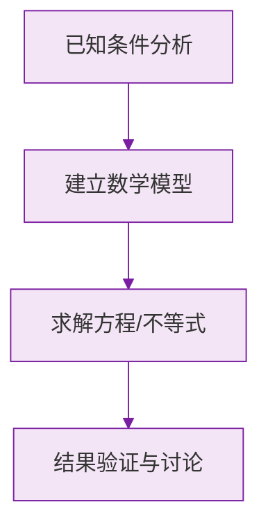

# 从算式到方程

标签：#中考必考 #基础

## 一、为什么要学方程

**算术方法**：从已知量出发，一步步"顺着算"到答案；
**方程方法**：把未知数设为 $x$，让它和已知数**平起平坐**地参与列式，再"解"出来。

例：一支笔比一本书便宜 7 元，书 12 元，笔多少元？

- 算术：$12 - 7 = 5$（逆着想）；
- 方程：设笔 $x$ 元，则 $x + 7 = 12$（顺着题意直译）。

题目越复杂，方程"顺着题意直译"的优势越明显。

## 二、方程与一元一次方程

**含有未知数的等式叫做方程。**

两个条件缺一不可：① 是等式（有等号）；② 含未知数。

| 式子 | 是方程吗 | 原因 |
|---|---|---|
| $2x + 1 = 5$ | ✔ | 等式 + 含未知数 |
| $2x + 1$ | ✘ | 不是等式 |
| $3 + 4 = 7$ | ✘ | 不含未知数 |
| $x + y = 3$ | ✔ | 是方程（但不是一元的） |

**一元一次方程**：只含**一个**未知数（一元），未知数的次数都是 **1**（一次），且等号两边都是**整式**的方程。

标准形式：$ax + b = 0$（$a \ne 0$）。

> ⚠️ **易错点**：
> 1. $x^2 = 4$ 不是一次方程（次数为 2）；
> 2. $\frac{1}{x} = 2$ 不是一元一次方程（左边不是整式）；
> 3. $x + y = 5$ 不是一元方程（两个未知数）。

## 三、方程的解

**使方程左右两边相等的未知数的值，叫做方程的解。**

检验 $x = 2$ 是不是方程 $3x - 1 = 5$ 的解：代入左边 $3 \times 2 - 1 = 5 =$ 右边 ✔，所以 $x = 2$ 是解。

> 💡 "解方程"是**过程**，"方程的解"是**结果**，两个词不要混用。

## 四、列方程的一般步骤

1. **审**：弄清已知量、未知量；
2. **设**：设未知数（通常设所求量为 $x$，带单位）；
3. **列**：找**相等关系**，翻译成方程。

找相等关系的常见抓手：总量 = 各部分之和；相同量从两个角度表示；不变量。

## 五、要点小结

1. 方程 = 等式 + 未知数；
2. 一元一次方程：一个未知数、次数为 1、两边是整式；
3. 方程的解可以用**代入检验**；
4. 列方程的核心是找到**相等关系**。

## 六、知识联系

- 判断"次数"要用[[4.1 整式]]的概念；
- 解方程的依据是[[等式的性质]]；
- 系统解法见[[5.2 解一元一次方程]]。

### 数学几何与函数分析

<svg xmlns="http://www.w3.org/2000/svg" viewBox="0 0 300 200" style="background-color: #f3e5f5; border: 1px solid #7b1fa2; border-radius: 8px;">
  <line x1="20" y1="180" x2="280" y2="180" stroke="#7b1fa2" stroke-width="2" />
  <line x1="50" y1="20" x2="50" y2="180" stroke="#7b1fa2" stroke-width="2" />
  <path d="M50,180 Q150,20 280,180" fill="none" stroke="#9c27b0" stroke-width="3" />
  <text x="260" y="195" fill="#7b1fa2" font-size="12">X轴</text>
  <text x="10" y="30" fill="#7b1fa2" font-size="12">Y轴</text>
  <text x="140" y="100" fill="#7b1fa2" font-size="14">抛物线图示</text>
</svg>

