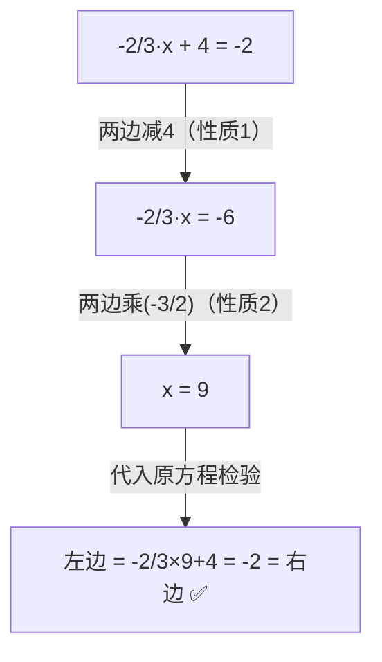

# 例题 · 等式的性质

## 例题 1（基础 · 判断变形依据）

### 题目

下列变形分别依据等式的哪条性质？

(1) 由 $x - 3 = 5$ 得 $x = 8$；
(2) 由 $\frac{x}{4} = 2$ 得 $x = 8$；
(3) 由 $3x = 2x + 6$ 得 $x = 6$。

### 解析

(1) 两边同**加 3**——性质 1；

(2) 两边同**乘 4**——性质 2；

(3) 两边同**减 $2x$**——性质 1（注意：同加减的可以是**式子**）。

> 💡 说依据时要讲清"两边同（加/减/乘/除）什么"。

---

## 例题 2（基础 · 找错误）

### 题目

下列变形中错误的是（　　）

A. 由 $a = b$ 得 $a + 2 = b + 2$
B. 由 $a = b$ 得 $-3a = -3b$
C. 由 $\frac{a}{c} = \frac{b}{c}$ 得 $a = b$
D. 由 $ax = ay$ 得 $x = y$

### 解析

- A：性质 1 ✔；
- B：性质 2（同乘 $-3$）✔；
- C：两边同乘 $c$（$\frac{a}{c}$ 有意义说明 $c \ne 0$）✔；
- D：**错误**——若 $a = 0$，则 $0 = 0$ 恒成立，但 $x$、$y$ 可以不等。两边同除以 $a$ 必须保证 $a \ne 0$。

**答案：D**

> ⚠️ "两边同除以字母"必须先确认字母非零，这是本节最重要的陷阱。

---

## 例题 3（中档 · 用性质解方程）

### 题目

利用等式的性质解方程，并写出每步依据：$-\frac{2}{3}x + 4 = -2$。

### 解析

两边减 4（性质 1）：

$$
-\frac{2}{3}x = -6
$$

两边乘 $-\frac{3}{2}$（性质 2）：

$$
x = -6 \times \left(-\frac{3}{2}\right) = 9
$$

检验：左边 $= -\frac{2}{3} \times 9 + 4 = -6 + 4 = -2 =$ 右边 ✔。

**答案：$x = 9$**

---

## 例题 4（提高 · 天平模型）

### 题目

天平两边平衡：左盘放 3 个相同的小球和 1 个 10 克砝码，右盘放 1 个同样的小球和 1 个 30 克砝码。每个小球重多少克？

### 解析

设每个小球重 $x$ 克，由平衡列等式：

$$
3x + 10 = x + 30
$$

两边同减 $x$（性质 1）：$2x + 10 = 30$；

两边同减 10（性质 1）：$2x = 20$；

两边同除以 2（性质 2）：$x = 10$。

**答案：每个小球重 $10$ 克**

> 💡 天平的"同时拿走"操作就是等式性质的具象化——理解了天平，就理解了解方程。
