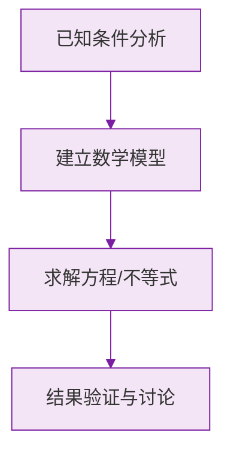

# 公式与定义卡片 · 等式的性质

## 1. 性质 1（加减）

$$
a = b \implies a \pm c = b \pm c
$$

## 2. 性质 2（乘除）

$$
a = b \implies ac = bc
$$

$$
a = b,\ c \neq 0 \implies \frac{a}{c} = \frac{b}{c}
$$

## 3. 移项法则（性质 1 的推论）

$$
a + b = c \iff a = c - b
$$

移项必变号。

## 4. 对称性与传递性

$$
a = b \iff b = a
$$

$$
a = b,\ b = c \implies a = c
$$

### 数学几何与函数分析

<svg xmlns="http://www.w3.org/2000/svg" viewBox="0 0 300 200" style="background-color: #f3e5f5; border: 1px solid #7b1fa2; border-radius: 8px;">
  <line x1="20" y1="180" x2="280" y2="180" stroke="#7b1fa2" stroke-width="2" />
  <line x1="50" y1="20" x2="50" y2="180" stroke="#7b1fa2" stroke-width="2" />
  <path d="M50,180 Q150,20 280,180" fill="none" stroke="#9c27b0" stroke-width="3" />
  <text x="260" y="195" fill="#7b1fa2" font-size="12">X轴</text>
  <text x="10" y="30" fill="#7b1fa2" font-size="12">Y轴</text>
  <text x="140" y="100" fill="#7b1fa2" font-size="14">抛物线图示</text>
</svg>

