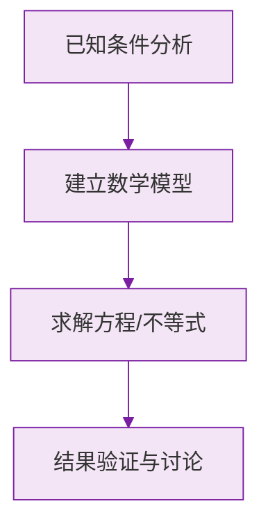

# 等式的性质

标签：#中考必考 #基础

## 一、等式的两条基本性质

把等式想象成一架**天平**：两边平衡时，同时加、减、乘、除相同的"砝码"，天平仍然平衡。

### 性质 1（加减）

**等式两边加（或减）同一个数（或式子），结果仍相等。**

$$
a = b \implies a + c = b + c, \quad a - c = b - c
$$

### 性质 2（乘除）

**等式两边乘同一个数，或除以同一个不为 0 的数，结果仍相等。**

$$
a = b \implies ac = bc; \qquad a = b,\ c \neq 0 \implies \frac{a}{c} = \frac{b}{c}
$$

> ⚠️ **易错点**：除法必须强调**除数不为 0**！"两边同除以 $x$"是危险操作——$x$ 可能是 0。

## 二、用等式性质解简单方程

例：解方程 $2x + 5 = 9$。

1. 两边**减 5**（性质 1）：$2x = 4$；
2. 两边**除以 2**（性质 2）：$x = 2$。

每一步变形的目标都是让方程逐渐变成 **$x = a$** 的形式。

## 三、"移项"的本质

由性质 1 可以推出常用操作——**移项**：

$$
x + 3 = 7 \iff x = 7 - 3
$$

**把等式一边的某项变号后移到另一边，叫做移项。** 它就是"两边同减（加）该项"的简写。

> ⚠️ **易错点**：移项**必须变号**！$5x = 2x + 9$ 移项得 $5x - 2x = 9$（$+2x$ 移过来变 $-2x$），不变号是解方程的头号错误。

## 四、等式性质的其他推论

- **对称性**：$a = b \implies b = a$（等式两边可交换）；
- **传递性**：$a = b,\ b = c \implies a = c$。

## 五、要点小结

1. 性质 1：两边同加减，等式不变；
2. 性质 2：两边同乘除（除数非 0），等式不变；
3. 移项 = 性质 1 的快捷方式，**过桥变号**；
4. 天平模型帮助理解每一步变形。

## 六、知识联系

- 等式的性质是[[5.2 解一元一次方程]]全部步骤的理论依据；
- 初二学不等式时会对比"不等式的性质"（乘除负数要变号），届时回看本节。

### 数学几何与函数分析

<svg xmlns="http://www.w3.org/2000/svg" viewBox="0 0 300 200" style="background-color: #f3e5f5; border: 1px solid #7b1fa2; border-radius: 8px;">
  <line x1="20" y1="180" x2="280" y2="180" stroke="#7b1fa2" stroke-width="2" />
  <line x1="50" y1="20" x2="50" y2="180" stroke="#7b1fa2" stroke-width="2" />
  <path d="M50,180 Q150,20 280,180" fill="none" stroke="#9c27b0" stroke-width="3" />
  <text x="260" y="195" fill="#7b1fa2" font-size="12">X轴</text>
  <text x="10" y="30" fill="#7b1fa2" font-size="12">Y轴</text>
  <text x="140" y="100" fill="#7b1fa2" font-size="14">抛物线图示</text>
</svg>

