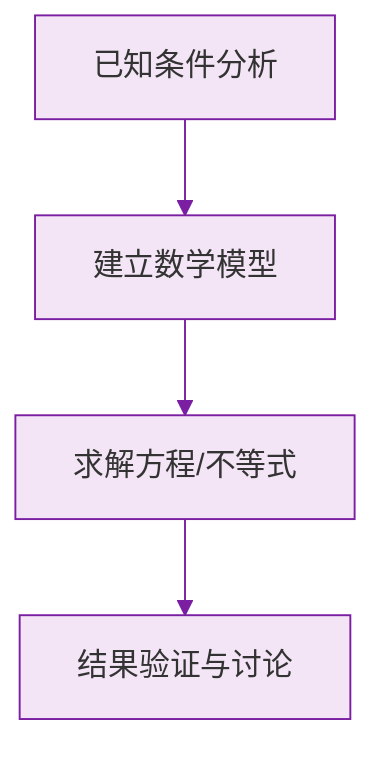

# 例题 · 解一元一次方程

## 例题 1（基础 · 移项合并）

### 题目

解方程：$7x - 4 = 3x + 8$。

### 解析

移项（$3x$ 左移变 $-3x$，$-4$ 右移变 $+4$）：

$$
7x - 3x = 8 + 4
$$

合并：$4x = 12$；系数化 1：

$$
x = 3
$$

**答案：$x = 3$**

---

## 例题 2（基础 · 去括号）

### 题目

解方程：$2(x - 3) - 3(2x + 1) = 7$。

### 解析

去括号（注意 $-3$ 乘进去每项变号）：

$$
2x - 6 - 6x - 3 = 7
$$

合并：$-4x - 9 = 7$；移项：$-4x = 16$；系数化 1：

$$
x = -4
$$

**答案：$x = -4$**

> ⚠️ $-3(2x + 1) = -6x - 3$，第二项是 $-3$ 不是 $+3$。

---

## 例题 3（中档 · 去分母）

### 题目

解方程：$\dfrac{2x - 1}{3} - \dfrac{x + 2}{4} = 1$。

### 解析

两边乘 12（3、4 的最小公倍数），分子加括号：

$$
4(2x - 1) - 3(x + 2) = 12
$$

去括号：

$$
8x - 4 - 3x - 6 = 12
$$

合并：$5x - 10 = 12$；移项：$5x = 22$；系数化 1：

$$
x = \frac{22}{5}
$$

**答案：$x = \dfrac{22}{5}$**

> ⚠️ 去分母后右边的 1 变成 12（也要乘！），分子必须整体加括号。

---

## 例题 4（中档 · 分母含小数）

### 题目

解方程：$\dfrac{0.4x - 0.9}{0.5} = \dfrac{0.1x + 0.5}{0.2}$。

### 解析

先利用分数性质把分母化为整数（分子分母同乘 10）：

$$
\frac{4x - 9}{5} = \frac{x + 5}{2}
$$

两边乘 10：

$$
2(4x - 9) = 5(x + 5)
$$

去括号：$8x - 18 = 5x + 25$；移项合并：$3x = 43$：

$$
x = \frac{43}{3}
$$

**答案：$x = \dfrac{43}{3}$**

> 💡 小数分母先"扩分"成整数，再走常规五步，比直接硬算稳得多。

---

## 例题 5（提高 · 含参数讨论）

### 题目

已知关于 $x$ 的方程 $3x - 2m = x + 4$ 的解是 $x = m$ 的解的 2 倍多 1，其中方程 $x = m$ 即已知 $x$ 的值为 $m$。若该方程的解为 $x = 2m + 1$，求 $m$ 的值。

### 解析

由题意，$x = 2m + 1$ 是方程 $3x - 2m = x + 4$ 的解，代入：

$$
3(2m + 1) - 2m = (2m + 1) + 4
$$

去括号：

$$
6m + 3 - 2m = 2m + 5
$$

合并移项：

$$
4m + 3 = 2m + 5 \implies 2m = 2 \implies m = 1
$$

**答案：$m = 1$**

> 💡 "某值是方程的解" = 把它**代入方程成立**，由此得到关于参数的新方程。

### 数学几何与函数分析

<svg xmlns="http://www.w3.org/2000/svg" viewBox="0 0 300 200" style="background-color: #f3e5f5; border: 1px solid #7b1fa2; border-radius: 8px;">
  <line x1="20" y1="180" x2="280" y2="180" stroke="#7b1fa2" stroke-width="2" />
  <line x1="50" y1="20" x2="50" y2="180" stroke="#7b1fa2" stroke-width="2" />
  <path d="M50,180 Q150,20 280,180" fill="none" stroke="#9c27b0" stroke-width="3" />
  <text x="260" y="195" fill="#7b1fa2" font-size="12">X轴</text>
  <text x="10" y="30" fill="#7b1fa2" font-size="12">Y轴</text>
  <text x="140" y="100" fill="#7b1fa2" font-size="14">抛物线图示</text>
</svg>

