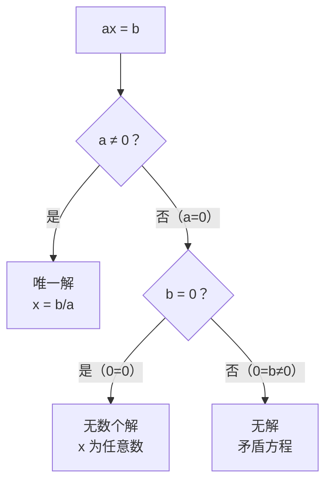

# 公式与定义卡片 · 解一元一次方程

## 1. 五步流程

$$
\text{去分母} \to \text{去括号} \to \text{移项} \to \text{合并同类项} \to \text{系数化为 } 1
$$

## 2. 去分母

两边乘所有分母的**最小公倍数** $L$：

$$
\frac{a}{m} + \frac{b}{n} = c \xrightarrow{\times L} \frac{L}{m}a + \frac{L}{n}b = Lc
$$

## 3. 移项

$$
ax + b = cx + d \implies ax - cx = d - b
$$

## 4. 系数化为 1

$$
ax = b \ (a \neq 0) \implies x = \frac{b}{a}
$$

## 5. $ax = b$ 解的讨论

