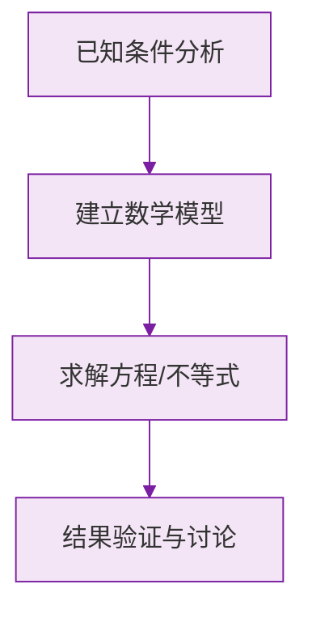

# 公式与定义卡片 · 解一元一次方程

## 1. 五步流程

$$
\text{去分母} \to \text{去括号} \to \text{移项} \to \text{合并同类项} \to \text{系数化为 } 1
$$

## 2. 去分母

两边乘所有分母的**最小公倍数** $L$：

$$
\frac{a}{m} + \frac{b}{n} = c \xrightarrow{\times L} \frac{L}{m}a + \frac{L}{n}b = Lc
$$

## 3. 移项

$$
ax + b = cx + d \implies ax - cx = d - b
$$

## 4. 系数化为 1

$$
ax = b \ (a \neq 0) \implies x = \frac{b}{a}
$$

## 5. $ax = b$ 解的讨论

$$
\begin{cases}
a \neq 0: & x = \dfrac{b}{a} \ \text{（唯一解）} \\
a = 0,\ b = 0: & \text{解为任意数} \\
a = 0,\ b \neq 0: & \text{无解}
\end{cases}
$$

### 数学几何与函数分析

<svg xmlns="http://www.w3.org/2000/svg" viewBox="0 0 300 200" style="background-color: #f3e5f5; border: 1px solid #7b1fa2; border-radius: 8px;">
  <line x1="20" y1="180" x2="280" y2="180" stroke="#7b1fa2" stroke-width="2" />
  <line x1="50" y1="20" x2="50" y2="180" stroke="#7b1fa2" stroke-width="2" />
  <path d="M50,180 Q150,20 280,180" fill="none" stroke="#9c27b0" stroke-width="3" />
  <text x="260" y="195" fill="#7b1fa2" font-size="12">X轴</text>
  <text x="10" y="30" fill="#7b1fa2" font-size="12">Y轴</text>
  <text x="140" y="100" fill="#7b1fa2" font-size="14">抛物线图示</text>
</svg>

