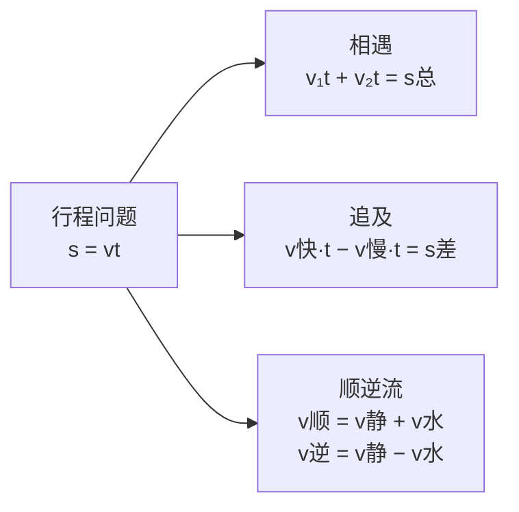

# 公式与定义卡片 · 实际问题与一元一次方程

## 1. 行程问题

## 2. 工程问题

$$
\text{总量} = 1, \quad \text{效率} = \frac{1}{\text{单独完成天数}}, \quad \sum \text{各部分工作量} = 1
$$

## 3. 利润问题

$$
\text{利润} = \text{售价} - \text{进价}
$$

$$
\text{利润率} = \frac{\text{售价} - \text{进价}}{\text{进价}} \times 100\%
$$

$$
\text{打 } x \text{ 折售价} = \text{标价} \times \frac{x}{10}
$$

## 4. 配套问题

甲:乙 $= m : n$ 配套时：

$$
n \times \text{甲总数} = m \times \text{乙总数}
$$

## 5. 增长率

$$
\text{增长后} = \text{基数} \times (1 + p\%)
$$
