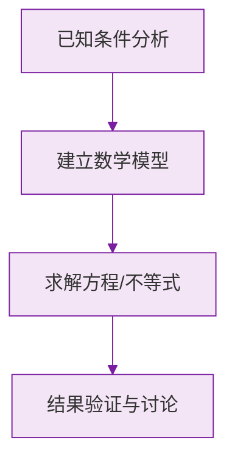

# 公式与定义卡片 · 实际问题与一元一次方程

## 1. 行程问题

$$
s = vt
$$

$$
\text{相遇}: v_1 t + v_2 t = s_{\text{总}}, \qquad \text{追及}: v_{\text{快}} t - v_{\text{慢}} t = s_{\text{差}}
$$

$$
v_{\text{顺}} = v_{\text{静}} + v_{\text{水}}, \qquad v_{\text{逆}} = v_{\text{静}} - v_{\text{水}}
$$

## 2. 工程问题

$$
\text{总量} = 1, \quad \text{效率} = \frac{1}{\text{单独完成天数}}, \quad \sum \text{各部分工作量} = 1
$$

## 3. 利润问题

$$
\text{利润} = \text{售价} - \text{进价}
$$

$$
\text{利润率} = \frac{\text{售价} - \text{进价}}{\text{进价}} \times 100\%
$$

$$
\text{打 } x \text{ 折售价} = \text{标价} \times \frac{x}{10}
$$

## 4. 配套问题

甲:乙 $= m : n$ 配套时：

$$
n \times \text{甲总数} = m \times \text{乙总数}
$$

## 5. 增长率

$$
\text{增长后} = \text{基数} \times (1 + p\%)
$$

### 数学几何与函数分析

<svg xmlns="http://www.w3.org/2000/svg" viewBox="0 0 300 200" style="background-color: #f3e5f5; border: 1px solid #7b1fa2; border-radius: 8px;">
  <line x1="20" y1="180" x2="280" y2="180" stroke="#7b1fa2" stroke-width="2" />
  <line x1="50" y1="20" x2="50" y2="180" stroke="#7b1fa2" stroke-width="2" />
  <path d="M50,180 Q150,20 280,180" fill="none" stroke="#9c27b0" stroke-width="3" />
  <text x="260" y="195" fill="#7b1fa2" font-size="12">X轴</text>
  <text x="10" y="30" fill="#7b1fa2" font-size="12">Y轴</text>
  <text x="140" y="100" fill="#7b1fa2" font-size="14">抛物线图示</text>
</svg>

