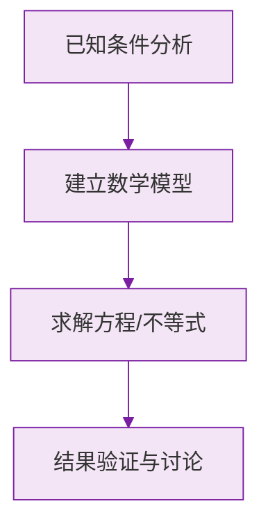

# 例题 · 立体图形与平面图形

## 例题 1（基础 · 图形识别）

### 题目

下列图形中，属于立体图形的是（　　）

A. 三角形　　B. 圆　　C. 圆锥　　D. 线段

### 解析

三角形、圆、线段的所有点都在同一平面内，是平面图形；圆锥的点不都在同一平面内，是立体图形。

**答案：C**

---

## 例题 2（基础 · 从不同方向看）

### 题目

从正面、上面、左面看圆柱，分别得到什么平面图形？

### 解析

设圆柱直立放置：

- 正面看：**长方形**（宽为底面直径，高为圆柱高）；
- 上面看：**圆**；
- 左面看：**长方形**（与正面相同）。

**答案：长方形、圆、长方形**

> 💡 "看"的结果是**平面图形的轮廓**，不要画成立体的样子。

---

## 例题 3（中档 · 正方体展开图判断）

### 题目

一个正方体的展开图为"田"字形加两格（即某行出现 2×2 的"田"字结构）。它能折成正方体吗？为什么？

### 解析

含"田"字结构时，折叠后田字的四个面中必有两个面**重叠**，无法围成正方体。

**答案：不能。含"田"字或"凹"字结构的展开图都不能折成正方体**

> 💡 快速排除法：先找"田""凹"，再数格子是否恰好 6 个。

---

## 例题 4（中档 · 相对面问题）

### 题目

一个正方体展开图呈 1-4-1 型：中间一行从左到右依次标有数字 $2$、$3$、$4$、$5$，上方（与 $3$ 相邻）标 $1$，下方（与 $3$ 相邻）标 $6$。折成正方体后，与 $3$ 相对的面是几？与 $1$ 相对的面是几？

### 解析

1-4-1 型中，中间一行**隔一个**的两面相对：

- $2$ 与 $4$ 相对，$3$ 与 $5$ 相对；
- 上下两翼 $1$ 与 $6$ 相对。

**答案：与 $3$ 相对的是 $5$；与 $1$ 相对的是 $6$**

> 💡 口诀："同行隔一相对，两翼相对"。相对面在展开图中永不相邻。

---

## 例题 5（提高 · 棱柱元素计数）

### 题目

一个棱柱有 18 条棱，它是几棱柱？有多少个顶点、多少个面？

### 解析

设为 $n$ 棱柱，棱数 $3n = 18$，得 $n = 6$，是**六棱柱**。

- 顶点数：$2n = 12$ 个；
- 面数：$n + 2 = 8$ 个。

验证欧拉公式：$V - E + F = 12 - 18 + 8 = 2$ ✔。

**答案：六棱柱，12 个顶点，8 个面**

### 数学几何与函数分析

<svg xmlns="http://www.w3.org/2000/svg" viewBox="0 0 300 200" style="background-color: #f3e5f5; border: 1px solid #7b1fa2; border-radius: 8px;">
  <line x1="20" y1="180" x2="280" y2="180" stroke="#7b1fa2" stroke-width="2" />
  <line x1="50" y1="20" x2="50" y2="180" stroke="#7b1fa2" stroke-width="2" />
  <path d="M50,180 Q150,20 280,180" fill="none" stroke="#9c27b0" stroke-width="3" />
  <text x="260" y="195" fill="#7b1fa2" font-size="12">X轴</text>
  <text x="10" y="30" fill="#7b1fa2" font-size="12">Y轴</text>
  <text x="140" y="100" fill="#7b1fa2" font-size="14">抛物线图示</text>
</svg>

