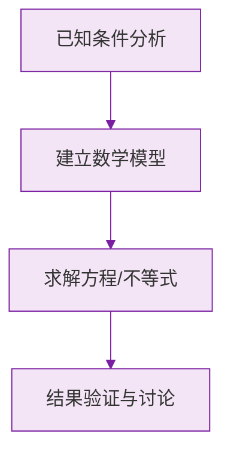

# 公式与定义卡片 · 立体图形与平面图形

## 1. $n$ 棱柱的元素

$$
\text{顶点数} = 2n, \qquad \text{棱数} = 3n, \qquad \text{面数} = n + 2
$$

## 2. 欧拉公式（了解）

多面体的顶点数 $V$、棱数 $E$、面数 $F$ 满足：

$$
V - E + F = 2
$$

## 3. 正方体展开图种数

$$
\text{共 } 11 \text{ 种}: \ 1\text{-}4\text{-}1 \ (6 \text{ 种}),\ 2\text{-}3\text{-}1 \ (3 \text{ 种}),\ 2\text{-}2\text{-}2 \ (1 \text{ 种}),\ 3\text{-}3 \ (1 \text{ 种})
$$

## 4. 常见几何体从三方向看

| 几何体 | 正面 | 上面 |
|---|---|---|
| 圆柱 | 长方形 | 圆 |
| 圆锥 | 等腰三角形 | 圆（带圆心点） |
| 球 | 圆 | 圆 |
| 正方体 | 正方形 | 正方形 |

### 数学几何与函数分析

<svg xmlns="http://www.w3.org/2000/svg" viewBox="0 0 300 200" style="background-color: #f3e5f5; border: 1px solid #7b1fa2; border-radius: 8px;">
  <line x1="20" y1="180" x2="280" y2="180" stroke="#7b1fa2" stroke-width="2" />
  <line x1="50" y1="20" x2="50" y2="180" stroke="#7b1fa2" stroke-width="2" />
  <path d="M50,180 Q150,20 280,180" fill="none" stroke="#9c27b0" stroke-width="3" />
  <text x="260" y="195" fill="#7b1fa2" font-size="12">X轴</text>
  <text x="10" y="30" fill="#7b1fa2" font-size="12">Y轴</text>
  <text x="140" y="100" fill="#7b1fa2" font-size="14">抛物线图示</text>
</svg>

