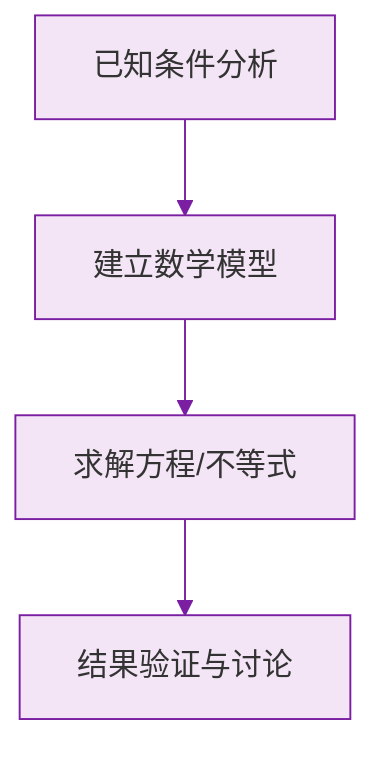

# 公式与定义卡片 · 点线面体

## 1. 构成链条

$$
\text{点} \xrightarrow{\text{动}} \text{线} \xrightarrow{\text{动}} \text{面} \xrightarrow{\text{动}} \text{体}
$$

反向（静态观点）：

$$
\text{体由面围成，面面交线，线线交点}
$$

## 2. 分类

$$
\text{面} \begin{cases} \text{平面} \\ \text{曲面} \end{cases}
\qquad
\text{线} \begin{cases} \text{直线} \\ \text{曲线} \end{cases}
$$

## 3. 三大旋转体

$$
\text{长方形绕一边} \to \text{圆柱}
$$

$$
\text{直角三角形绕直角边} \to \text{圆锥}
$$

$$
\text{半圆绕直径} \to \text{球}
$$

### 数学几何与函数分析

<svg xmlns="http://www.w3.org/2000/svg" viewBox="0 0 300 200" style="background-color: #f3e5f5; border: 1px solid #7b1fa2; border-radius: 8px;">
  <line x1="20" y1="180" x2="280" y2="180" stroke="#7b1fa2" stroke-width="2" />
  <line x1="50" y1="20" x2="50" y2="180" stroke="#7b1fa2" stroke-width="2" />
  <path d="M50,180 Q150,20 280,180" fill="none" stroke="#9c27b0" stroke-width="3" />
  <text x="260" y="195" fill="#7b1fa2" font-size="12">X轴</text>
  <text x="10" y="30" fill="#7b1fa2" font-size="12">Y轴</text>
  <text x="140" y="100" fill="#7b1fa2" font-size="14">抛物线图示</text>
</svg>

