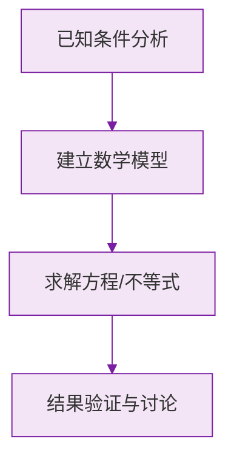

# 点、线、面、体

标签：#了解即可 #基础

## 一、几何体的构成要素

**几何体**（简称**体**）由**面**围成；面与面相交成**线**；线与线相交成**点**。

| 要素 | 说明 | 例子 |
|---|---|---|
| 体 | 占据空间的几何图形 | 长方体、球 |
| 面 | 包围体的表面，分**平面**与**曲面** | 长方体的面是平的，圆柱侧面是曲的 |
| 线 | 面与面的交界，分**直线**与**曲线** | 长方体的棱是直的，圆柱底面圆周是曲的 |
| 点 | 线与线的交点 | 长方体的顶点 |

例：圆柱有 **3 个面**（2 个平面底 + 1 个曲面侧面），**2 条线**（两条圆形曲线），没有顶点。

## 二、运动的观点："点动成线，线动成面，面动成体"

| 运动 | 结果 | 生活实例 |
|---|---|---|
| **点动成线** | 点运动的轨迹是线 | 流星划过夜空、笔尖写字 |
| **线动成面** | 线运动扫出面 | 雨刷扫玻璃、旋转门 |
| **面动成体** | 面运动生成体 | 硬币旋转成球形、长方形纸片绕边旋转成圆柱 |

常考旋转结论：

- **长方形**绕它的一边旋转一周 → **圆柱**；
- **直角三角形**绕一条直角边旋转一周 → **圆锥**；
- **半圆**绕直径旋转一周 → **球**。

> ⚠️ **易错点**：直角三角形绕**斜边**旋转得到的是两个圆锥拼成的"陀螺"形，不是单个圆锥。

## 三、点的重要性

点是几何中最基本的图形：

- 交通图上，点表示城市；
- 数轴上，点表示数；
- 一切图形都可以看作**点的集合**。

## 四、要点小结

1. 体由面围成，面面交线，线线交点；
2. 面分平曲、线分直曲；
3. 点动成线、线动成面、面动成体；
4. 记住三大旋转：长方形 → 圆柱，直角三角形 → 圆锥，半圆 → 球。

## 五、知识联系

- 上一节[[立体图形与平面图形]]从整体识形，本节拆到"零件"级别；
- 点和线的深入研究从[[6.2 直线、射线、线段]]开始。

### 数学几何与函数分析

<svg xmlns="http://www.w3.org/2000/svg" viewBox="0 0 300 200" style="background-color: #f3e5f5; border: 1px solid #7b1fa2; border-radius: 8px;">
  <line x1="20" y1="180" x2="280" y2="180" stroke="#7b1fa2" stroke-width="2" />
  <line x1="50" y1="20" x2="50" y2="180" stroke="#7b1fa2" stroke-width="2" />
  <path d="M50,180 Q150,20 280,180" fill="none" stroke="#9c27b0" stroke-width="3" />
  <text x="260" y="195" fill="#7b1fa2" font-size="12">X轴</text>
  <text x="10" y="30" fill="#7b1fa2" font-size="12">Y轴</text>
  <text x="140" y="100" fill="#7b1fa2" font-size="14">抛物线图示</text>
</svg>

