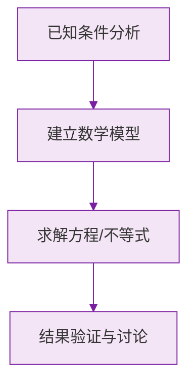

# 公式与定义卡片 · 直线、射线、线段

## 1. 两个基本事实

$$
\text{两点确定一条直线}
$$

$$
\text{两点之间，线段最短}
$$

## 2. 线段的和差

点 $C$ 在线段 $AB$ 上：

$$
AC + CB = AB
$$

## 3. 中点公式

$M$ 为线段 $AB$ 的中点：

$$
AM = MB = \frac{1}{2} AB, \qquad AB = 2AM = 2MB
$$

## 4. 数线段规律

直线上 $n$ 个点确定的线段数：

$$
N = \frac{n(n-1)}{2}
$$

## 5. 过点作直线的规律

平面内 $n$ 个点（任意三点不共线）确定的直线数：

$$
N = \frac{n(n-1)}{2}
$$

### 数学几何与函数分析

<svg xmlns="http://www.w3.org/2000/svg" viewBox="0 0 300 200" style="background-color: #f3e5f5; border: 1px solid #7b1fa2; border-radius: 8px;">
  <line x1="20" y1="180" x2="280" y2="180" stroke="#7b1fa2" stroke-width="2" />
  <line x1="50" y1="20" x2="50" y2="180" stroke="#7b1fa2" stroke-width="2" />
  <path d="M50,180 Q150,20 280,180" fill="none" stroke="#9c27b0" stroke-width="3" />
  <text x="260" y="195" fill="#7b1fa2" font-size="12">X轴</text>
  <text x="10" y="30" fill="#7b1fa2" font-size="12">Y轴</text>
  <text x="140" y="100" fill="#7b1fa2" font-size="14">抛物线图示</text>
</svg>

