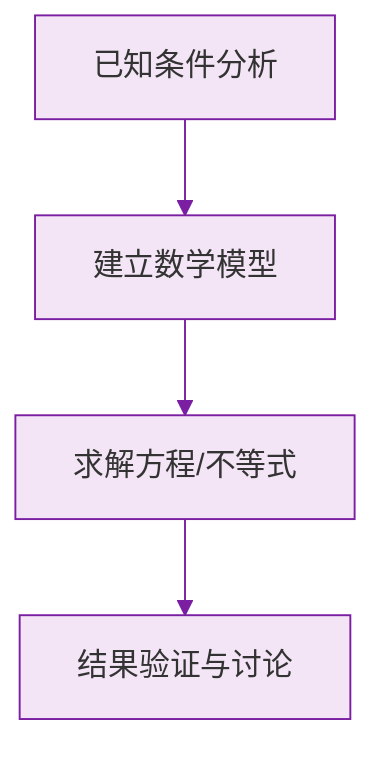

# 6.2 直线、射线、线段

标签：#中考必考 #基础 #易错

## 一、三种"线"的对比

| | 直线 | 射线 | 线段 |
|---|---|---|---|
| 端点 | 无 | 1 个 | 2 个 |
| 延伸性 | 向两方无限延伸 | 向一方无限延伸 | 不延伸 |
| 可否度量 | 不可 | 不可 | **可以** |
| 表示法 | 直线 $AB$ 或直线 $l$ | 射线 $OA$（端点字母在前） | 线段 $AB$ 或线段 $a$ |

> ⚠️ **易错点**：
> 1. 射线 $OA$ 与射线 $AO$ **不同**（端点不同，方向不同）；
> 2. 直线 $AB$ 与直线 $BA$ 是**同一条**直线；
> 3. "延长线段 $AB$"指从 $B$ 向外延长；"反向延长"才是从 $A$ 向外。

## 二、两个基本事实（公理）

### 1. 直线公理

**经过两点有一条直线，并且只有一条直线。** 简记："两点确定一条直线。"

应用：植树时只要定好两端的树坑，其余树坑就能排成直线；木板上钉两颗钉子就能固定木条。

### 2. 线段公理

**两点的所有连线中，线段最短。** 简记："两点之间，线段最短。"

**两点的距离**：连接两点的**线段的长度**（注意：距离是"长度"这个数，不是线段本身）。

应用：把弯曲的河道改直可以缩短航程。

## 三、线段的比较与运算

### 比较方法

1. **度量法**：用刻度尺量出长度比大小；
2. **叠合法**：把一条线段移到另一条上，比端点位置。

### 线段的和差

若点 $C$ 在线段 $AB$ 上，则 $AC + CB = AB$，$AC = AB - CB$。

### 中点

若点 $M$ 在线段 $AB$ 上且 $AM = MB$，则 $M$ 是 $AB$ 的**中点**：

$$
AM = MB = \frac{1}{2}AB
$$

> ⚠️ **易错点**：由 $AM = MB$ 推"$M$ 是中点"必须先保证 **$M$ 在线段 $AB$ 上**——若 $M$ 在 $AB$ 的垂直平分线上（以后学）也满足距离相等但不是中点。

## 四、数线段的规律

一条直线上有 $n$ 个点，共能数出的线段条数：

$$
\frac{n(n-1)}{2}
$$

## 五、要点小结

1. 直线无端点、射线一个、线段两个；只有线段可度量；
2. 两点确定一条直线；两点之间线段最短；
3. 中点把线段分成相等两半；
4. 线段计算常分类讨论（点在线段上还是延长线上）。

## 六、知识联系

- 线段的比较与运算方法将平移到[[比较与运算|角的比较与运算]]——两者结构完全平行；
- [[角的概念|角]]由两条有公共端点的射线组成。

### 数学几何与函数分析

<svg xmlns="http://www.w3.org/2000/svg" viewBox="0 0 300 200" style="background-color: #f3e5f5; border: 1px solid #7b1fa2; border-radius: 8px;">
  <line x1="20" y1="180" x2="280" y2="180" stroke="#7b1fa2" stroke-width="2" />
  <line x1="50" y1="20" x2="50" y2="180" stroke="#7b1fa2" stroke-width="2" />
  <path d="M50,180 Q150,20 280,180" fill="none" stroke="#9c27b0" stroke-width="3" />
  <text x="260" y="195" fill="#7b1fa2" font-size="12">X轴</text>
  <text x="10" y="30" fill="#7b1fa2" font-size="12">Y轴</text>
  <text x="140" y="100" fill="#7b1fa2" font-size="14">抛物线图示</text>
</svg>

