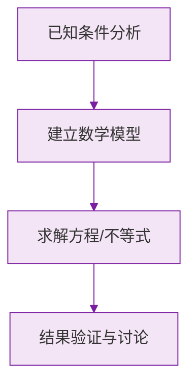

# 例题 · 角的概念

## 例题 1（基础 · 表示方法）

### 题目

如图（想象），射线 $OA$、$OB$、$OC$ 有公共端点 $O$。图中以 $O$ 为顶点的角共有几个？能记作 $\angle O$ 吗？

### 解析

三条射线两两组成角，共：

$$
\frac{3 \times 2}{2} = 3 \text{ 个}
$$

即 $\angle AOB$、$\angle BOC$、$\angle AOC$。

顶点 $O$ 处有多个角，**不能**简记为 $\angle O$，必须用三个字母表示。

**答案：3 个；不能**

> 💡 $n$ 条共端点射线组成 $\frac{n(n-1)}{2}$ 个角，与数线段同一个公式。

---

## 例题 2（基础 · 度分秒换算）

### 题目

(1) 把 $34.4°$ 化成度、分表示；
(2) 把 $50°42'$ 化成度表示。

### 解析

(1) $0.4° = 0.4 \times 60' = 24'$：

$$
34.4° = 34°24'
$$

(2) $42' = \frac{42}{60}° = 0.7°$：

$$
50°42' = 50.7°
$$

> ⚠️ 别按十进制想当然：$34.4° \ne 34°4'$。

---

## 例题 3（中档 · 度分秒运算）

### 题目

计算：(1) $48°39' + 67°45'$；(2) $90° - 25°38'$。

### 解析

(1) 分与分相加：$39' + 45' = 84' = 1°24'$，进位：

$$
48°39' + 67°45' = 115°84' = 116°24'
$$

(2) 借位：$90° = 89°60'$：

$$
89°60' - 25°38' = 64°22'
$$

**答案：(1) $116°24'$；(2) $64°22'$**

> 💡 加法"满 60 进 1"，减法"借 1 当 60"——像小学竖式，只是进制变了。

---

## 例题 4（中档 · 钟表角）

### 题目

求 8:20 时，时针与分针的夹角。

### 解析

用公式 $\theta = |30m - 5.5n|$，$m = 8$，$n = 20$：

$$
\theta = |30 \times 8 - 5.5 \times 20| = |240 - 110| = 130°
$$

**答案：$130°$**

> 💡 也可以分开算：分针指 4（$120°$ 处），时针在 8 过 20 分钟（$240° + 10° = 250°$ 处），差 $130°$。

---

## 例题 5（提高 · 旋转与角）

### 题目

射线 $OA$ 从正北方向开始，绕点 $O$ 顺时针旋转。转过多少度时它指向正东？继续转到正南呢？若转速为每秒 $5°$，从正北转到正南需要几秒？

### 解析

方位角基础：正北 → 正东是顺时针 $90°$；正北 → 正南是 $180°$。

从正北到正南需转 $180°$，转速 $5°$/秒：

$$
t = \frac{180°}{5°/\text{秒}} = 36 \text{ 秒}
$$

**答案：$90°$；$180°$；需 36 秒**

### 数学几何与函数分析

<svg xmlns="http://www.w3.org/2000/svg" viewBox="0 0 300 200" style="background-color: #f3e5f5; border: 1px solid #7b1fa2; border-radius: 8px;">
  <line x1="20" y1="180" x2="280" y2="180" stroke="#7b1fa2" stroke-width="2" />
  <line x1="50" y1="20" x2="50" y2="180" stroke="#7b1fa2" stroke-width="2" />
  <path d="M50,180 Q150,20 280,180" fill="none" stroke="#9c27b0" stroke-width="3" />
  <text x="260" y="195" fill="#7b1fa2" font-size="12">X轴</text>
  <text x="10" y="30" fill="#7b1fa2" font-size="12">Y轴</text>
  <text x="140" y="100" fill="#7b1fa2" font-size="14">抛物线图示</text>
</svg>

