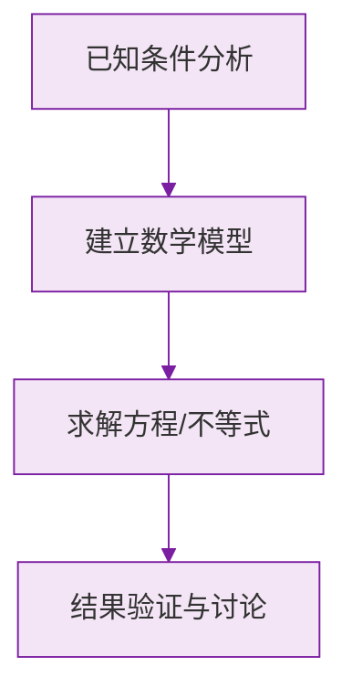

# 公式与定义卡片 · 角的概念

## 1. 度分秒换算（60 进制）

$$
1° = 60', \qquad 1' = 60''
$$

度化分：乘 60；分化度：除以 60。

## 2. 角的分类

$$
0° < \text{锐角} < 90° = \text{直角} < \text{钝角} < 180° = \text{平角}, \qquad \text{周角} = 360°
$$

## 3. 钟表角速度

$$
\text{时针}: \frac{360°}{12 \times 60 \text{ 分}} = 0.5°/\text{分}, \qquad \text{分针}: \frac{360°}{60 \text{ 分}} = 6°/\text{分}
$$

## 4. $m$ 点整时两针夹角

$$
\theta = 30° \times m \quad (m \le 6 \text{ 时})
$$

$m$ 点 $n$ 分时：

$$
\theta = |30m + 0.5n - 6n| = |30m - 5.5n| \ \text{（大于 180° 时用 360° 减）}
$$

### 数学几何与函数分析

<svg xmlns="http://www.w3.org/2000/svg" viewBox="0 0 300 200" style="background-color: #f3e5f5; border: 1px solid #7b1fa2; border-radius: 8px;">
  <line x1="20" y1="180" x2="280" y2="180" stroke="#7b1fa2" stroke-width="2" />
  <line x1="50" y1="20" x2="50" y2="180" stroke="#7b1fa2" stroke-width="2" />
  <path d="M50,180 Q150,20 280,180" fill="none" stroke="#9c27b0" stroke-width="3" />
  <text x="260" y="195" fill="#7b1fa2" font-size="12">X轴</text>
  <text x="10" y="30" fill="#7b1fa2" font-size="12">Y轴</text>
  <text x="140" y="100" fill="#7b1fa2" font-size="14">抛物线图示</text>
</svg>

