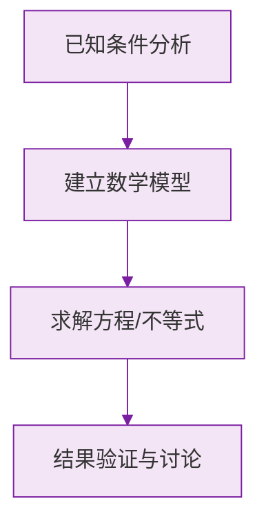

# 角的概念

标签：#中考必考 #基础

## 一、角的定义

**有公共端点的两条射线组成的图形叫做角。**

- 公共端点是角的**顶点**；
- 两条射线是角的**两边**。

动态定义：角也可以看作一条射线绕它的端点**旋转**形成的图形。射线转到与起始位置成一条直线时形成**平角**（$180°$），转一整圈形成**周角**（$360°$）。

## 二、角的表示方法

| 方法 | 示例 | 适用条件 |
|---|---|---|
| 三个大写字母 | $\angle AOB$ | 通用（**顶点字母必须写中间**） |
| 一个大写字母 | $\angle O$ | 顶点处只有一个角时 |
| 数字 | $\angle 1$ | 图上标了数字 |
| 希腊字母 | $\angle \alpha$ | 图上标了希腊字母 |

> ⚠️ **易错点**：顶点处有多个角时（如 $O$ 处有 $\angle AOB$、$\angle BOC$），**不能**简写成 $\angle O$，必须用三个字母。

## 三、角的度量与单位换算

角的单位：**度、分、秒**，是 **60 进制**：

$$
1° = 60', \qquad 1' = 60''
$$

换算示例：

- $0.5° = 30'$（乘 60）；
- $27.3° = 27°18'$（$0.3 \times 60 = 18$）；
- $45°45' = 45.75°$（$45 \div 60 = 0.75$）。

> ⚠️ **易错点**：度分秒是 60 进制不是 10 进制！$1°30' \neq 1.3°$，而是 $1.5°$。

## 四、角的分类

| 名称 | 范围 |
|---|---|
| 锐角 | $0° < \alpha < 90°$ |
| 直角 | $\alpha = 90°$ |
| 钝角 | $90° < \alpha < 180°$ |
| 平角 | $\alpha = 180°$ |
| 周角 | $\alpha = 360°$ |

## 五、钟表角问题（高频考点）

- 时针每小时转 $30°$，每分钟转 $0.5°$；
- 分针每分钟转 $6°$。

例：3:00 整，时针与分针的夹角是 $3 \times 30° = 90°$。

## 六、要点小结

1. 角 = 公共端点 + 两条射线；
2. 三字母表示法顶点居中；
3. 度分秒 60 进制，换算"乘 60 往小、除 60 往大"；
4. 时针 $0.5°$/分、分针 $6°$/分是钟表题钥匙。

## 七、知识联系

- 角的两边是[[6.2 直线、射线、线段|射线]]；
- 角的大小比较、和差、平分线见[[比较与运算]]；
- 特殊数量关系（互余互补）见[[余角和补角]]。

### 数学几何与函数分析

<svg xmlns="http://www.w3.org/2000/svg" viewBox="0 0 300 200" style="background-color: #f3e5f5; border: 1px solid #7b1fa2; border-radius: 8px;">
  <line x1="20" y1="180" x2="280" y2="180" stroke="#7b1fa2" stroke-width="2" />
  <line x1="50" y1="20" x2="50" y2="180" stroke="#7b1fa2" stroke-width="2" />
  <path d="M50,180 Q150,20 280,180" fill="none" stroke="#9c27b0" stroke-width="3" />
  <text x="260" y="195" fill="#7b1fa2" font-size="12">X轴</text>
  <text x="10" y="30" fill="#7b1fa2" font-size="12">Y轴</text>
  <text x="140" y="100" fill="#7b1fa2" font-size="14">抛物线图示</text>
</svg>

