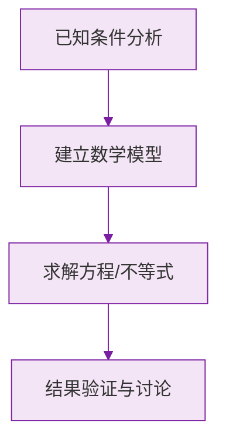

# 例题 · 角的比较与运算

## 例题 1（基础 · 角的和差）

### 题目

已知 $\angle AOB = 75°$，射线 $OC$ 在 $\angle AOB$ 内部，且 $\angle AOC = 28°36'$。求 $\angle COB$ 的度数。

### 解析

$OC$ 在内部，用减法（借 1 当 60）：

$$
\angle COB = 75° - 28°36' = 74°60' - 28°36' = 46°24'
$$

**答案：$\angle COB = 46°24'$**

---

## 例题 2（基础 · 角平分线）

### 题目

$OC$ 是 $\angle AOB$ 的平分线，$OD$ 是 $\angle BOC$ 的平分线，且 $\angle BOD = 20°$。求 $\angle AOB$ 的度数。

### 解析

$OD$ 平分 $\angle BOC$：

$$
\angle BOC = 2\angle BOD = 40°
$$

$OC$ 平分 $\angle AOB$：

$$
\angle AOB = 2\angle BOC = 80°
$$

**答案：$\angle AOB = 80°$**

> 💡 平分线嵌套问题从"最里层"往外一步步翻倍。

---

## 例题 3（中档 · 方程思想）

### 题目

射线 $OC$ 在 $\angle AOB$ 内部，$\angle AOB = 84°$，且 $\angle AOC : \angle COB = 3 : 4$。求 $\angle AOC$ 的度数。

### 解析

设 $\angle AOC = 3x$，$\angle COB = 4x$：

$$
3x + 4x = 84° \implies 7x = 84° \implies x = 12°
$$

$$
\angle AOC = 3x = 36°
$$

**答案：$\angle AOC = 36°$**

> 💡 比例关系设"份数 × $x$"，是角度计算与方程结合的标准姿势。

---

## 例题 4（中档 · 分类讨论）

### 题目

已知 $\angle AOB = 60°$，$\angle BOC = 20°$，求 $\angle AOC$ 的度数。

### 解析

$OC$ 的位置没有限定，分两种情况：

**情况 1**：$OC$ 在 $\angle AOB$ **内部**：

$$
\angle AOC = 60° - 20° = 40°
$$

**情况 2**：$OC$ 在 $\angle AOB$ **外部**（$OB$ 的另一侧）：

$$
\angle AOC = 60° + 20° = 80°
$$

**答案：$\angle AOC = 40°$ 或 $80°$**

> ⚠️ 没有图的角度计算题，几乎都要分类讨论——先画两张草图再动笔。

---

## 例题 5（提高 · 平分线综合）

### 题目

$O$ 为直线 $AB$ 上一点，射线 $OC$ 使 $\angle AOC = 40°$。$OM$ 平分 $\angle AOC$，$ON$ 平分 $\angle BOC$。求 $\angle MON$ 的度数。

### 解析

$A$、$O$、$B$ 共线，所以：

$$
\angle BOC = 180° - 40° = 140°
$$

两条平分线：

$$
\angle MOC = \frac{40°}{2} = 20°, \qquad \angle NOC = \frac{140°}{2} = 70°
$$

$OM$、$ON$ 分别在 $OC$ 两侧：

$$
\angle MON = \angle MOC + \angle NOC = 20° + 70° = 90°
$$

**答案：$\angle MON = 90°$**

> 💡 结论可推广：**邻补角的两条平分线互相垂直**（$\frac{\alpha}{2} + \frac{180° - \alpha}{2} = 90°$），记住能秒杀选择题。

### 数学几何与函数分析

<svg xmlns="http://www.w3.org/2000/svg" viewBox="0 0 300 200" style="background-color: #f3e5f5; border: 1px solid #7b1fa2; border-radius: 8px;">
  <line x1="20" y1="180" x2="280" y2="180" stroke="#7b1fa2" stroke-width="2" />
  <line x1="50" y1="20" x2="50" y2="180" stroke="#7b1fa2" stroke-width="2" />
  <path d="M50,180 Q150,20 280,180" fill="none" stroke="#9c27b0" stroke-width="3" />
  <text x="260" y="195" fill="#7b1fa2" font-size="12">X轴</text>
  <text x="10" y="30" fill="#7b1fa2" font-size="12">Y轴</text>
  <text x="140" y="100" fill="#7b1fa2" font-size="14">抛物线图示</text>
</svg>

