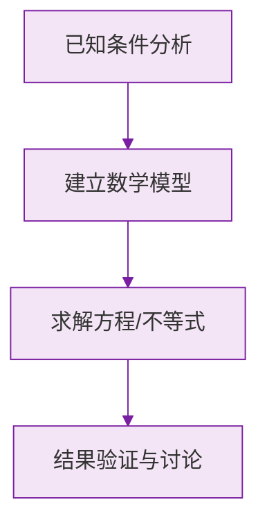

# 公式与定义卡片 · 角的比较与运算

## 1. 角的和差（$OC$ 在 $\angle AOB$ 内部）

$$
\angle AOC + \angle COB = \angle AOB
$$

## 2. 角平分线

$OC$ 平分 $\angle AOB$：

$$
\angle AOC = \angle COB = \frac{1}{2}\angle AOB
$$

$$
\angle AOB = 2\angle AOC
$$

## 3. 度分秒加减

$$
\text{加法：分秒满 } 60 \text{ 进 } 1
$$

$$
\text{减法：借 } 1 \text{ 当 } 60
$$

## 4. 度分秒乘除

乘法：各单位分别乘，再进位整理；

除法：从高位除起，余数化低位继续除。

$$
25°20' \times 3 = 75°60' = 76°
$$

### 数学几何与函数分析

<svg xmlns="http://www.w3.org/2000/svg" viewBox="0 0 300 200" style="background-color: #f3e5f5; border: 1px solid #7b1fa2; border-radius: 8px;">
  <line x1="20" y1="180" x2="280" y2="180" stroke="#7b1fa2" stroke-width="2" />
  <line x1="50" y1="20" x2="50" y2="180" stroke="#7b1fa2" stroke-width="2" />
  <path d="M50,180 Q150,20 280,180" fill="none" stroke="#9c27b0" stroke-width="3" />
  <text x="260" y="195" fill="#7b1fa2" font-size="12">X轴</text>
  <text x="10" y="30" fill="#7b1fa2" font-size="12">Y轴</text>
  <text x="140" y="100" fill="#7b1fa2" font-size="14">抛物线图示</text>
</svg>

