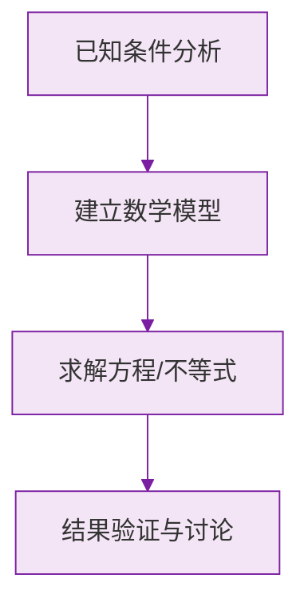

# 角的比较与运算

标签：#中考必考 #基础 #易错

## 一、角的大小比较

与线段完全平行的两种方法：

1. **度量法**：用量角器量出度数比较；
2. **叠合法**：使两角顶点及一边重合，看另一边的位置。

## 二、角的和差

如果射线 $OC$ 在 $\angle AOB$ **内部**，那么：

$$
\angle AOC + \angle COB = \angle AOB
$$

$$
\angle AOC = \angle AOB - \angle COB
$$

角的和差本质上是**度数的加减**，注意度分秒 60 进制的进借位。

## 三、角平分线

**从一个角的顶点出发，把这个角分成两个相等的角的射线，叫做这个角的平分线。**

若 $OC$ 平分 $\angle AOB$，则：

$$
\angle AOC = \angle COB = \frac{1}{2}\angle AOB, \qquad \angle AOB = 2\angle AOC = 2\angle COB
$$

类似地还有三等分线等。

> 💡 **对照记忆**：角平分线之于角，正如[[6.2 直线、射线、线段|线段中点]]之于线段——概念、公式、题型全都平行，一起复习效率翻倍。

## 四、角的计算题的两大主线

### 1. 方程思想

设某个角为 $x$，用"和差、倍分"关系列方程。

例：$\angle AOB = 90°$，$OC$ 在其内部且 $\angle AOC = 2\angle COB$，求 $\angle COB$。

设 $\angle COB = x$，则 $2x + x = 90°$，$x = 30°$。

### 2. 分类讨论

射线 $OC$ 可能在 $\angle AOB$ **内部或外部**，两种位置的答案不同（加与减）。题目未给图时必须讨论。

> ⚠️ **易错点**：
> 1. 求"$\angle AOC$ 的度数"时漏掉 $OC$ 在外部的情况；
> 2. 度分秒计算中"借 1 当 60"忘了借；
> 3. $\frac{1}{2}\angle AOB$ 与 $\frac{1}{2}\angle AOC$ 混淆——看清平分的是哪个角。

## 五、要点小结

1. 比较：度量法、叠合法；
2. 和差：内部射线做"分割"，度数直接加减；
3. 角平分线 → 一半关系，配合方程求解；
4. 无图题先想"位置有几种可能"。

## 六、知识联系

- 概念基础见[[角的概念]]；
- 与线段的[[6.2 直线、射线、线段|中点问题]]方法互通；
- 两角和为特殊值（$90°$、$180°$）的情形见[[余角和补角]]。

### 数学几何与函数分析

<svg xmlns="http://www.w3.org/2000/svg" viewBox="0 0 300 200" style="background-color: #f3e5f5; border: 1px solid #7b1fa2; border-radius: 8px;">
  <line x1="20" y1="180" x2="280" y2="180" stroke="#7b1fa2" stroke-width="2" />
  <line x1="50" y1="20" x2="50" y2="180" stroke="#7b1fa2" stroke-width="2" />
  <path d="M50,180 Q150,20 280,180" fill="none" stroke="#9c27b0" stroke-width="3" />
  <text x="260" y="195" fill="#7b1fa2" font-size="12">X轴</text>
  <text x="10" y="30" fill="#7b1fa2" font-size="12">Y轴</text>
  <text x="140" y="100" fill="#7b1fa2" font-size="14">抛物线图示</text>
</svg>

