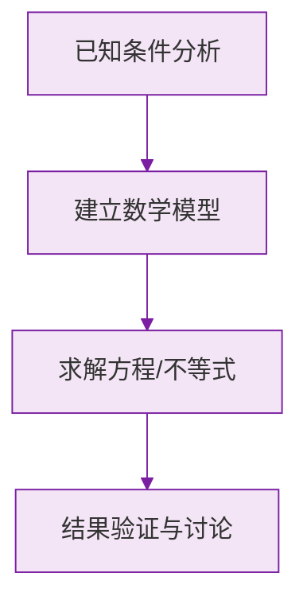

# 例题 · 余角和补角

## 例题 1（基础 · 求余角补角）

### 题目

求 $37°24'$ 的余角和补角。

### 解析

余角（借 1 当 60）：

$$
90° - 37°24' = 89°60' - 37°24' = 52°36'
$$

补角：

$$
180° - 37°24' = 179°60' - 37°24' = 142°36'
$$

**答案：余角 $52°36'$，补角 $142°36'$**

> 💡 验证：补角 $-$ 余角 $= 142°36' - 52°36' = 90°$ ✔。

---

## 例题 2（基础 · 概念判断）

### 题目

下列说法正确的是（　　）

A. 钝角没有补角
B. 若 $\angle 1 + \angle 2 + \angle 3 = 180°$，则这三个角互补
C. 一个锐角的补角一定是钝角
D. 互余的两个角必须有公共顶点

### 解析

- A 错误：钝角小于 $180°$，有补角（是锐角）；
- B 错误：互补只针对**两个**角；
- C **正确**：$\alpha < 90° \implies 180° - \alpha > 90°$，且小于 $180°$，是钝角；
- D 错误：互余与位置无关。

**答案：C**

---

## 例题 3（中档 · 方程思想）

### 题目

一个角的补角是它的余角的 4 倍，求这个角。

### 解析

设这个角为 $x$（$0° < x < 90°$，否则没有余角）：

$$
180° - x = 4(90° - x)
$$

去括号：

$$
180° - x = 360° - 4x \implies 3x = 180° \implies x = 60°
$$

检验：补角 $120°$，余角 $30°$，$120° = 4 \times 30°$ ✔。

**答案：这个角是 $60°$**

---

## 例题 4（中档 · 性质说理）

### 题目

已知 $\angle 1$ 与 $\angle 2$ 互余，$\angle 1$ 与 $\angle 3$ 互余。$\angle 2$ 与 $\angle 3$ 相等吗？请说明理由。

### 解析

因为 $\angle 1 + \angle 2 = 90°$，所以 $\angle 2 = 90° - \angle 1$；

因为 $\angle 1 + \angle 3 = 90°$，所以 $\angle 3 = 90° - \angle 1$；

所以 $\angle 2 = \angle 3$（**同角的余角相等**）。

**答案：相等，依据"同角的余角相等"**

> 💡 这是最早的"几何说理"训练——每一步都要写依据，为以后的证明打基础。

---

## 例题 5（提高 · 方位角综合）

### 题目

灯塔 $O$ 处观测：船 $A$ 在北偏东 $40°$ 方向，船 $B$ 在南偏东 $25°$ 方向。求 $\angle AOB$ 的度数。

### 解析

以 $O$ 为中心，正北与正南方向成一条直线（$180°$）。

$OA$ 与正北方向夹 $40°$（偏东侧），$OB$ 与正南方向夹 $25°$（偏东侧）。三个角拼成平角：

$$
\angle AOB = 180° - 40° - 25° = 115°
$$

**答案：$\angle AOB = 115°$**

> 💡 方位角题先画"十字方向架"（北上南下、东右西左），把每条射线按度数摆进去，答案就在图里。

### 数学几何与函数分析

<svg xmlns="http://www.w3.org/2000/svg" viewBox="0 0 300 200" style="background-color: #f3e5f5; border: 1px solid #7b1fa2; border-radius: 8px;">
  <line x1="20" y1="180" x2="280" y2="180" stroke="#7b1fa2" stroke-width="2" />
  <line x1="50" y1="20" x2="50" y2="180" stroke="#7b1fa2" stroke-width="2" />
  <path d="M50,180 Q150,20 280,180" fill="none" stroke="#9c27b0" stroke-width="3" />
  <text x="260" y="195" fill="#7b1fa2" font-size="12">X轴</text>
  <text x="10" y="30" fill="#7b1fa2" font-size="12">Y轴</text>
  <text x="140" y="100" fill="#7b1fa2" font-size="14">抛物线图示</text>
</svg>

