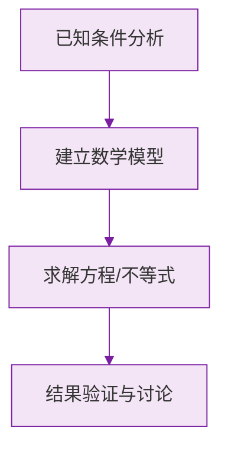

# 公式与定义卡片 · 余角和补角

## 1. 定义式

$$
\text{互余}: \angle 1 + \angle 2 = 90°, \qquad \text{互补}: \angle 1 + \angle 2 = 180°
$$

## 2. 求余角与补角

$$
\alpha \text{ 的余角} = 90° - \alpha \quad (0° < \alpha < 90°)
$$

$$
\alpha \text{ 的补角} = 180° - \alpha \quad (0° < \alpha < 180°)
$$

## 3. 性质

$$
\text{同角（等角）的余角相等；同角（等角）的补角相等}
$$

## 4. 补角与余角的差

$$
(180° - \alpha) - (90° - \alpha) = 90°
$$

同一个锐角的补角恒比余角大 $90°$。

## 5. 方位角表示

$$
\text{北偏东 } \theta,\ \text{北偏西 } \theta,\ \text{南偏东 } \theta,\ \text{南偏西 } \theta \quad (0° < \theta < 90°)
$$

北偏东 $45°$ 即东北方向。

### 数学几何与函数分析

<svg xmlns="http://www.w3.org/2000/svg" viewBox="0 0 300 200" style="background-color: #f3e5f5; border: 1px solid #7b1fa2; border-radius: 8px;">
  <line x1="20" y1="180" x2="280" y2="180" stroke="#7b1fa2" stroke-width="2" />
  <line x1="50" y1="20" x2="50" y2="180" stroke="#7b1fa2" stroke-width="2" />
  <path d="M50,180 Q150,20 280,180" fill="none" stroke="#9c27b0" stroke-width="3" />
  <text x="260" y="195" fill="#7b1fa2" font-size="12">X轴</text>
  <text x="10" y="30" fill="#7b1fa2" font-size="12">Y轴</text>
  <text x="140" y="100" fill="#7b1fa2" font-size="14">抛物线图示</text>
</svg>

