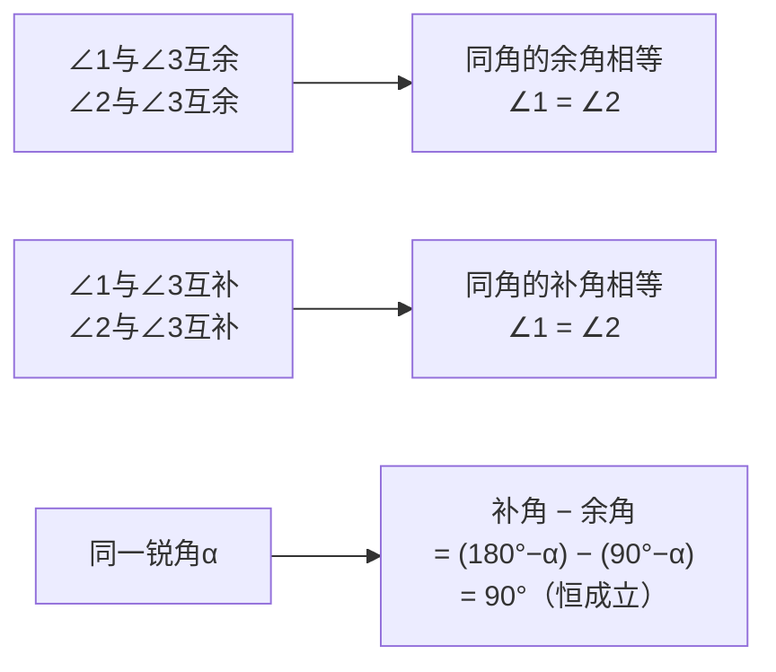

# 公式与定义卡片 · 余角和补角

## 1. 定义式

$$
\text{互余}: \angle 1 + \angle 2 = 90°, \qquad \text{互补}: \angle 1 + \angle 2 = 180°
$$

## 2. 求余角与补角

$$
\alpha \text{ 的余角} = 90° - \alpha \quad (0° < \alpha < 90°)
$$

$$
\alpha \text{ 的补角} = 180° - \alpha \quad (0° < \alpha < 180°)
$$

## 3. 性质

## 4. 补角与余角的差

$$
(180° - \alpha) - (90° - \alpha) = 90°
$$

同一个锐角的补角恒比余角大 $90°$。

## 5. 方位角表示

$$
\text{北偏东 } \theta,\ \text{北偏西 } \theta,\ \text{南偏东 } \theta,\ \text{南偏西 } \theta \quad (0° < \theta < 90°)
$$

北偏东 $45°$ 即东北方向。
