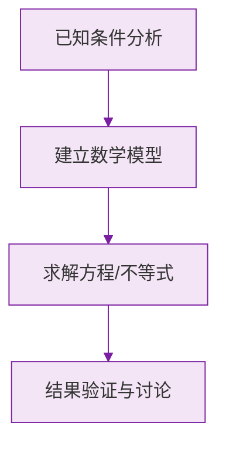

# 余角和补角

标签：#中考必考 #基础 #易错

## 一、定义

| 概念 | 定义 | 式子 |
|---|---|---|
| **互为余角**（互余） | 两个角的和等于 $90°$ | $\angle 1 + \angle 2 = 90°$ |
| **互为补角**（互补） | 两个角的和等于 $180°$ | $\angle 1 + \angle 2 = 180°$ |

- $\angle \alpha$ 的余角 $= 90° - \angle \alpha$；
- $\angle \alpha$ 的补角 $= 180° - \angle \alpha$。

> ⚠️ **易错点**：
> 1. 互余、互补说的是**数量关系**，与两个角的**位置无关**——不必相邻；
> 2. 互余、互补都是**两个角**之间的关系，三个角的和为 $90°$ 不叫互余；
> 3. 只有**小于 $90°$ 的角（锐角）才有余角**；只有小于 $180°$ 的角才有补角。

## 二、重要性质

### 性质 1：同角（等角）的余角相等

$$
\text{若 } \angle 1 + \angle 3 = 90°,\ \angle 2 + \angle 3 = 90°, \text{ 则 } \angle 1 = \angle 2
$$

### 性质 2：同角（等角）的补角相等

$$
\text{若 } \angle 1 + \angle 3 = 180°,\ \angle 2 + \angle 3 = 180°, \text{ 则 } \angle 1 = \angle 2
$$

这两条性质是初中几何**说理**（证明）的最早素材，务必会用"因为…所以…"的格式书写。

### 常用小结论

同一个角 $\alpha$（锐角）的补角比余角大 $90°$：

$$
(180° - \alpha) - (90° - \alpha) = 90°
$$

## 三、方位角（本节常配套考）

以正北或正南方向为基准，用"北偏东 $30°$""南偏西 $45°$"描述方向：

- **北偏东 $45°$** 也叫**东北方向**；
- 方位角从正北（或正南）方向线出发，**转向东（西）方向**度量。

## 四、解题主线：方程思想

"一个角的补角比它的余角的 3 倍少 $20°$"这类题，设角为 $x$，把余角、补角都用 $x$ 表示，列方程：

$$
180° - x = 3(90° - x) - 20°
$$

## 五、要点小结

1. 互余和为 $90°$，互补和为 $180°$，只看数量不看位置；
2. 余角 $= 90° - \alpha$，补角 $= 180° - \alpha$；
3. 同角（等角）的余角相等、补角相等；
4. 补角总比余角大 $90°$；
5. 求角问题设 $x$ 列方程。

## 六、知识联系

- 承接[[比较与运算|角的和差运算]]；
- "同角的补角相等"是初一下[[两条直线相交|对顶角相等]]证明的核心引理；
- 方位角在初二解直角三角形应用题中重现。

### 数学几何与函数分析

<svg xmlns="http://www.w3.org/2000/svg" viewBox="0 0 300 200" style="background-color: #f3e5f5; border: 1px solid #7b1fa2; border-radius: 8px;">
  <line x1="20" y1="180" x2="280" y2="180" stroke="#7b1fa2" stroke-width="2" />
  <line x1="50" y1="20" x2="50" y2="180" stroke="#7b1fa2" stroke-width="2" />
  <path d="M50,180 Q150,20 280,180" fill="none" stroke="#9c27b0" stroke-width="3" />
  <text x="260" y="195" fill="#7b1fa2" font-size="12">X轴</text>
  <text x="10" y="30" fill="#7b1fa2" font-size="12">Y轴</text>
  <text x="140" y="100" fill="#7b1fa2" font-size="14">抛物线图示</text>
</svg>

