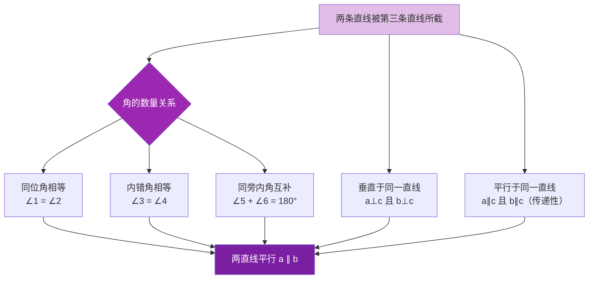

# 判定

标签：#中考必考 #重点

## 一、平行线的三个判定方法

两条直线被第三条直线所截：

**判定 1**：同位角相等，两直线平行。

$$\angle 1 = \angle 2 \Rightarrow a \parallel b \quad (\text{同位角})$$

**判定 2**：内错角相等，两直线平行。

$$\angle 2 = \angle 3 \Rightarrow a \parallel b \quad (\text{内错角})$$

**判定 3**：同旁内角互补，两直线平行。

$$\angle 2 + \angle 4 = 180^{\circ} \Rightarrow a \parallel b \quad (\text{同旁内角})$$

## 二、其他常用判定

- **平行公理推论**：平行于同一条直线的两条直线互相平行（$a \parallel c,\ b \parallel c \Rightarrow a \parallel b$）。
- **垂直推平行**：在同一平面内，垂直于同一条直线的两条直线互相平行（$a \perp c,\ b \perp c \Rightarrow a \parallel b$）。

> 💡 判定的逻辑方向：**由角的数量关系 → 得出两直线平行**（位置关系）。

## 三、例题解析

**例 1**：如图，$\angle 1 = 120^{\circ}$，$\angle 2 = 60^{\circ}$，$\angle 1$ 与 $\angle 2$ 是直线 $a$、$b$ 被 $c$ 所截的同旁内角，判断 $a$ 与 $b$ 是否平行。

**解**：$\angle 1 + \angle 2 = 120^{\circ} + 60^{\circ} = 180^{\circ}$，同旁内角互补，所以 $a \parallel b$。

**例 2**：$\angle B = 55^{\circ}$，$\angle DCE = 55^{\circ}$（$\angle B$ 与 $\angle DCE$ 是 $AB$、$CD$ 被 $BE$ 所截的同位角），证明 $AB \parallel CD$。

**证明**：因为 $\angle B = \angle DCE = 55^{\circ}$，由"同位角相等，两直线平行"得 $AB \parallel CD$。

**例 3**：已知 $\angle 1 = \angle 2$，$\angle 2$ 与 $\angle 3$ 是对顶角，$\angle 1$ 与 $\angle 3$ 是内错角，证明两直线平行。

**证明**：$\angle 2 = \angle 3$（对顶角相等），又 $\angle 1 = \angle 2$，所以 $\angle 1 = \angle 3$，由"内错角相等，两直线平行"得证。

## 四、易错点

1. 使用判定时必须写清**哪两条直线被哪条直线所截**，角的类型认错则结论无效。
2. 同旁内角是**互补**推平行，不是相等；三类角的条件不能混用。
3. 判定与性质方向相反：判定是"角 → 平行"，性质是"平行 → 角"，书写推理时依据不能写反。
4. "垂直于同一条直线的两直线平行"需要**同一平面内**这一前提。

## 五、自测题

1. $\angle 1$ 与 $\angle 2$ 是同位角且 $\angle 1 = \angle 2 = 70^{\circ}$，能否判定两直线平行？依据是什么？
2. 两条直线被第三条直线所截，同旁内角 $\angle A = 100^{\circ}$，$\angle B = 80^{\circ}$，两直线平行吗？
3. 判断：内错角互补，两直线平行。（对/错）

参考答案

1. 能。依据"同位角相等，两直线平行"。
2. 平行。$100^{\circ} + 80^{\circ} = 180^{\circ}$，同旁内角互补。
3. 错。应为"内错角**相等**，两直线平行"。

## 六、知识联系

- 三类角的位置定义见 [[被第三条直线所截]]；
- 平行线的定义与平行公理见 [[概念]]；
- 判定的"逆过程"——由平行得角的关系，见 [[性质]]；
- 命题的题设与结论、互逆关系见 [[7.3 定义、命题、定理]]。
