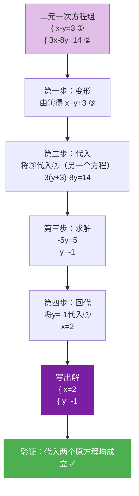

# 代入

标签：#中考必考 #重点

## 一、消元思想

解二元一次方程组的基本思路是**消元**——把"二元"化归为"一元"，转化成会解的一元一次方程。

**代入消元法**（简称代入法）：把方程组中一个方程变形，用含一个未知数的式子表示另一个未知数，再**代入**另一个方程，实现消元。

> 💡 变形时优先选择**系数为 1（或 $-1$）的未知数**来表示，计算最简便。

## 二、代入法的一般步骤

以解 $\begin{cases} x - y = 3 \ \ ① \\ 3x - 8y = 14 \ \ ② \end{cases}$ 为例：

1. **变形**：由①得 $x = y + 3$ ③；
2. **代入**：把③代入②：$3(y+3) - 8y = 14$；
3. **求解**：$3y + 9 - 8y = 14$，$-5y = 5$，$y = -1$；
4. **回代**：把 $y = -1$ 代入③得 $x = 2$；
5. **写解**：$\begin{cases} x = 2 \\ y = -1 \end{cases}$。

> 💡 变形时优先选择**系数为 1（或 $-1$）的未知数**来表示，计算最简便。

## 三、例题解析

**例 1**：解方程组 $\begin{cases} y = 2x - 3 \\ 3x + 2y = 8 \end{cases}$。

**解**：第一个方程已是"$y =$"形式，直接代入第二个方程：
$3x + 2(2x - 3) = 8$，$7x = 14$，$x = 2$；回代得 $y = 2 \times 2 - 3 = 1$。
所以 $\begin{cases} x = 2 \\ y = 1 \end{cases}$。

**例 2**：解方程组 $\begin{cases} 2x + y = 7 \ \ ① \\ 3x - 2y = 0 \ \ ② \end{cases}$。

**解**：由①得 $y = 7 - 2x$ ③；代入②：$3x - 2(7 - 2x) = 0$，$3x - 14 + 4x = 0$，$7x = 14$，$x = 2$；
代入③得 $y = 3$。解为 $\begin{cases} x = 2 \\ y = 3 \end{cases}$。

## 四、易错点

1. **代入时必须代入"另一个"方程**：把③代回它自己来源的①会得到恒等式 $0=0$，消不了元。
2. 代入含多项的式子要**加括号**：$3x - 2(7-2x)$，去括号注意符号。
3. 求出一个未知数后**别忘回代**求另一个未知数，方程组的解是一组值。
4. 检验方法：把解代入**原方程组的两个方程**，都成立才正确。

## 五、自测题

1. 用代入法解 $\begin{cases} x = y + 1 \\ x + 2y = 7 \end{cases}$。
2. 解方程组 $\begin{cases} 2x - y = 5 \\ 3x + 4y = 2 \end{cases}$。
3. 用代入法解方程组时，应优先选择什么样的方程变形？

参考答案

1. 代入得 $(y+1) + 2y = 7$，$y = 2$，$x = 3$。解为 $\begin{cases} x = 3 \\ y = 2 \end{cases}$。
2. 由第一式 $y = 2x - 5$，代入第二式：$3x + 8x - 20 = 2$，$x = 2$，$y = -1$。
3. 选择未知数系数为 1 或 $-1$ 的方程变形，避免分数运算。

## 六、知识联系

- 二元一次方程组的概念见 [[概念]]；
- 当两个方程中同一未知数系数相同或互为相反数时，用 [[加减]] 消元更快；
- 化归出的一元一次方程解法见 [[5.2 解一元一次方程]]；应用见 [[10.3 实际问题]]。
