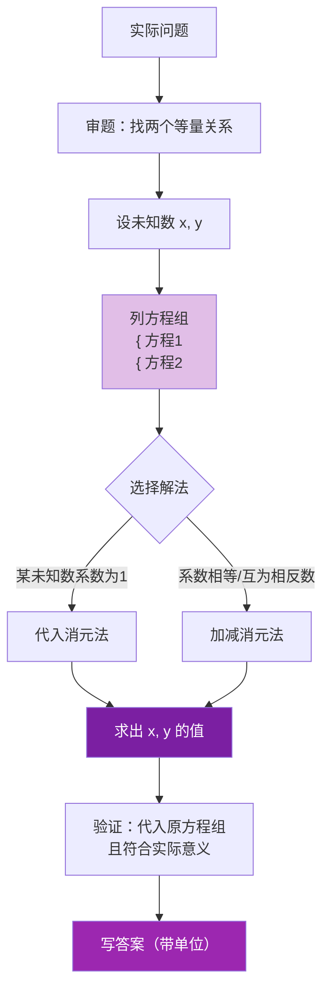

# 实际问题

标签：#中考必考 #应用

## 一、用方程组解应用题的一般步骤

1. **审**：审清题意，找出**两个等量关系**；
2. **设**：设两个未知数（直接设或间接设）；
3. **列**：根据等量关系列出**两个方程**，组成方程组；
4. **解**：用 [[代入]] 或 [[加减]] 消元求解；
5. **验**：检验解是否满足方程组且**符合实际意义**；
6. **答**：写出答案，带上单位。

> 💡 有两个未知量、两个等量关系时，设两个未知数列方程组往往比只设一个未知数更直接。

## 二、常见题型与等量关系

| 题型 | 常用关系式 |
|---|---|
| 和差倍分 | 甲 $+$ 乙 $=$ 总量；甲 $=$ 乙 $\times$ 倍数 |
| 行程问题 | 路程 $=$ 速度 $\times$ 时间；顺流速 $=$ 静水速 $+$ 水速 |
| 工程问题 | 工作量 $=$ 效率 $\times$ 时间 |
| 销售问题 | 利润 $=$ 售价 $-$ 进价；利润率 $= \dfrac{\text{利润}}{\text{进价}}$ |
| 配套问题 | 各部件数量比等于配套比 |

## 三、例题解析

**例 1（和差问题）**：篮球赛中胜一场得 2 分，负一场得 1 分。某队赛了 22 场共得 40 分，求胜负场数。

**解**：设胜 $x$ 场、负 $y$ 场。
$$\begin{cases} x + y = 22 \\ 2x + y = 40 \end{cases}$$
两式相减得 $x = 18$，则 $y = 4$。答：胜 18 场，负 4 场。

**例 2（配套问题）**：车间有 22 名工人，每人每天可生产螺钉 1200 个或螺母 2000 个，1 个螺钉配 2 个螺母。如何分配工人使当天产品刚好配套？

**解**：设 $x$ 人生产螺钉、$y$ 人生产螺母。配套关系：螺母总数 $= 2\times$ 螺钉总数。
$$\begin{cases} x + y = 22 \\ 2000y = 2 \times 1200x \end{cases}$$
由第二式 $y = \dfrac{6x}{5}$，代入第一式：$x + \dfrac{6x}{5} = 22$，$x = 10$，$y = 12$。
答：10 人生产螺钉，12 人生产螺母。

**例 3（行程问题）**：船顺流航行 $60\ \text{km}$ 用 3 h，逆流航行同样距离用 5 h，求静水船速 $v$ 与水速 $u$。

**解**：$$\begin{cases} 3(v + u) = 60 \\ 5(v - u) = 60 \end{cases}$$
即 $v + u = 20$，$v - u = 12$，相加得 $v = 16$，$u = 4$（单位 km/h）。

## 四、易错点

1. **配套问题**中比例关系易写反：1 个螺栓配 2 个螺母，应是"螺母总数 $= 2\times$ 螺栓总数"。
2. 单位不统一（小时与分钟、米与千米）就列方程，先**统一单位**。
3. 解出结果要检验**实际意义**：人数、场数应为非负整数。
4. 顺流、逆流速度分别是 $v+u$、$v-u$，别混淆。

## 五、自测题

1. 两数之和为 36，差为 8，求这两个数。
2. 买 3 支钢笔和 2 本笔记本共 35 元，买 1 支钢笔和 4 本笔记本共 25 元，求单价。
3. 鸡兔同笼，头 35 个，脚 94 只，求鸡兔各几只。

参考答案

1. 设两数 $x$、$y$：$x+y=36$，$x-y=8$，得 $x=22$，$y=14$。
2. 设钢笔 $x$ 元、笔记本 $y$ 元：$3x+2y=35$，$x+4y=25$，解得 $x=9$，$y=4$。
3. 设鸡 $x$、兔 $y$：$x+y=35$，$2x+4y=94$，解得 $x=23$，$y=12$。

## 六、知识联系

- 消元方法见 [[代入]] 与 [[加减]]；方程组概念见 [[概念]]；
- 一元一次方程的应用思路见 [[5.3 实际问题与一元一次方程]]，本节是其推广；
- 三个未知量的问题见 [[*10.4 三元一次方程组的解法（选学）]]。
